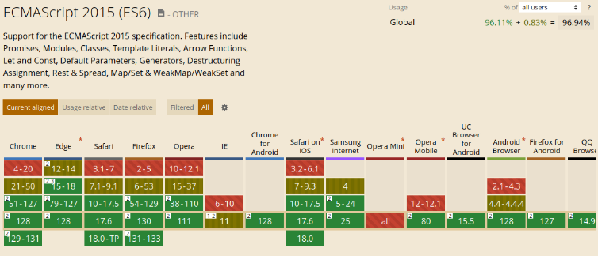
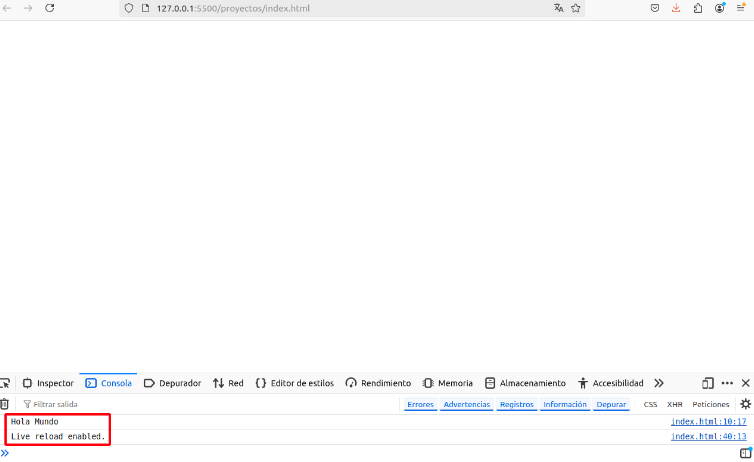
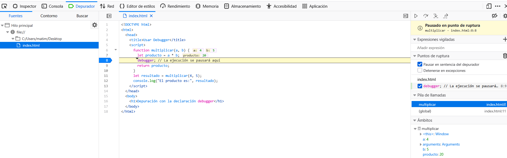
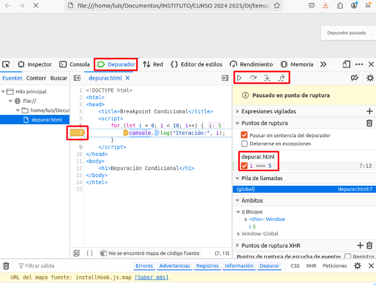

[⌂ Volver al inicio](index.md)

# Índice

1. [Introducción](#1-introducción)
2. [Variables y tipos de datos](#2-variables-y-tipos-de-datos)
    - [Práctica 2](#211-práctica-2-variables-y-tipos-de-datos)
3. [Estructuras de control](#estructuras-de-control)
    - [Práctica 3](#34-práctica-3-estructuras-de-control)
4. [Funciones](#4-funciones)
    - [Práctica 4](#45-práctica-4-funciones)
5. [Arrays](#5-arrays)
    - [Práctica 5](#52-práctica-5-arrays)
6. [Objetos](#6-objetos)
    - [Práctica 6](#610-práctica-6-objetos-y-clases)

7. [JSON](#json)
8. [Promesas](#promesas)
9. [DOM](#dom)
10. [BOM y Eventos](#bom-y-eventos)


---

# 1. Introducción

## 1.1 ECMAScript y JavaScript


El estándar que define el lenguaje JavaScript se denomina **ECMAScript**. La primera versión de este estándar fue lanzada en 1997, marcando el inicio de un lenguaje que ha evolucionado significativamente desde entonces.
La versión 6 de ECMAScript, conocida también como ECMAScript 2015 (ES2015), supuso una mejora
significativa en el lenguaje. Entre las novedades más destacadas se incluyen:

- **Clases**: Introducción de la sintaxis para la creación de clases con class.
- **Módulos**: Se introdujeron los módulos ES6 con import y export.
- **Bucles `for` ... of**: Nueva forma de iterar sobre elementos de un iterable.
- **Funciones Arrow**: Sintaxis más concisa para definir funciones con `() => {}`.
- **Promesas**: Manejo asincrónico de código a través de promesas (`Promise`).
- **Otras mejoras**: como `let`, `const`, destructuring, spread, etc.
  
La última especificación oficial, la versión 13 de ECMAScript, fue desarrollada en junio de 2022. Esta versión continuó con la evolución del lenguaje, incorporando nuevas funcionalidades y mejoras de rendimiento.

### 1.1.1 Soporte de Navegadores y Compatibilidad

Históricamente, los navegadores web han implementado las versiones de JavaScript con pequeñas
diferencias, lo que solía generar problemas para desarrollar scripts compatibles. Los desarrolladores debían detectar el tipo de navegador y programar variantes específicas para cada uno. Afortunadamente, este problema ha disminuido gracias a la estandarización y la evolución de los motores de ejecución de JavaScript.

Para verificar el soporte que ofrecen los distintos navegadores a las versiones de ECMAScript (ES5,
ES6, etc.), puedes consultar las siguientes páginas:

- [Can I use](https://caniuse.com/?search=javascript)
- [Compatibilidad ES6](https://compat-table.github.io/compat-table/es6/)

  

### 1.1.2 Transpilación de Código

Aunque el soporte de ES6 está muy avanzado, la **transpilación** sigue siendo una práctica común. Consiste en traducir código escrito en un lenguaje de alto nivel a otro del mismo nivel de abstracción. Por ejemplo:

- **De JavaScript ES6 a ES5**: Para asegurar una mayor compatibilidad con todos los navegadores.
- **De Java a Kotlin**: Para aprovechar las ventajas de Kotlin sobre Java.

Por otro lado, compilar se refiere a la traducción de un lenguaje de alto nivel a un nivel más bajo, como:

- **De código Java a Bytecode** (.class)
- **De código C a Código máquina**
  
Hasta hace poco, el soporte de ES6 en los navegadores web no era completo, lo que hacía necesario   transpilar el código ES6 a ES5 al desarrollar aplicaciones con frameworks como React o Angular. Esto   se hacía para garantizar la compatibilidad con una gama más amplia de navegadores, especialmente aquellos más antiguos como Internet Explorer, que no soportaban las nuevas características de   ECMAScript 2015 (ES6). Sin embargo, hoy en día, la mayoría de los navegadores modernos han adoptado completamente ES6 y versiones posteriores, lo que reduce la necesidad de transpilar el código   a ES5.

### 1.1.3 Ejecución de JavaScript

#### 1.1.3.1 En el Navegador Web

El código JavaScript se puede ejecutar directamente en un navegador web. Existen varias formas de incluir código JavaScript en una página:

- **Código interno**: Usando la etiqueta `<script>` dentro del documento HTML. Crea un documento `index.html` con el siguiente contenido. Usa las herramientas para desarrolladores tecla F12, y accede a la pestaña Consola.

  **`index.html`**

  ```html
  <html>
    <head>
      <title>Ejecutando Javascript en el navegador</title>
    </head>
    <body>
      <script type="text/javascript">
        console.log("Hola Mundo.");
        // Código JavaScript aquí
      </script>
    </body>
  </html>
  ```

Una página web se puede visualizar en el navegador de muchas formas:

- **Como archivo HTML local**: Abre en el navegador una ruta como `file:///home/usuario/proyecto/index.html`
  o `file://C:/Users/usuario/proyecto/index.html`.
- **Como archivo HTML** en un servidor web. Puedes usar una extensión (plugin) útil para visual
  studio code como Live Server para visualizar la página web en el navegador. Instala la extensión   Live Server desde el marketplace de vscode y pulsa F1 y selecciona Live Server: Open with Live Server.

- **Código externo**: Referenciando un archivo JavaScript externo.

  **`index.html`**

  ```html
  <html>
    <head>
      <title>Ejecutando Javascript en el navegador</title>
    </head>
    <body>
      <script src="js/programa.js" type="text/javascript"></script>
    </body>
  </html>
  ```

**js/programa.js**

```js
console.log("Hola mundo desde un fichero externo");
```



La consola del navegador es otra herramienta útil que permite ejecutar código JavaScript directamente en el navegador.

#### 1.1.3.2 Depuración en el navegador

Los navegadores modernos, como Google Chrome, Firefox, Edge y Safari, incluyen herramientas de
desarrollo (Developer Tools) que facilitan la depuración de código JavaScript. A continuación, se
explica cómo depurar en el navegador, acompañando la explicación con ejemplos prácticos.

##### 1.1.3.2.1 Acceder a las Herramientas de Desarrollo

En la mayoría de los navegadores, puedes acceder a las herramientas de desarrollo pulsando **F12** o **Ctrl+Shift+I** (Windows/Linux) o **Cmd+Option+I** (Mac).

##### 1.1.3.2.2 Usar la Consola (Console)

La consola es una herramienta poderosa para visualizar mensajes, errores y para interactuar directamente con el entorno de JavaScript.

**Ejemplo con `console.log`:**

```html
<!DOCTYPE html>
<html>
  <head>
    <title>Ejemplo de Depuración</title>
    <script>
      function saludar(nombre) {
        console.log("Función saludar iniciada");
        let mensaje = "Hola, " + nombre;
        console.log("Mensaje creado:", mensaje);
        return mensaje;
      }
      saludar("Mundo");
    </script>
  </head>
  <body>
    <h1>Revisa la consola para ver los mensajes</h1>
  </body>
</html>
```

**Pasos:**

1. Abre el archivo HTML en tu navegador.
2. Abre las herramientas de desarrollo (Ctrl + Shift + I).
3. Navega a la pestaña Console.
4. Verás los mensajes:
   Función saludar iniciada
   Mensaje creado: Hola, Mundo

##### 1.1.3.2.3 Establecer Puntos de Interrupción (Breakpoints)

Los breakpoints permiten pausar la ejecución del código en una línea específica para inspeccionar el estado de la aplicación.

**Ejemplo:**

```html
<!DOCTYPE html>
<html>
  <head>
    <title>Depuración con Breakpoints</title>
    <script>
      function calcularSuma(a, b) {
        let suma = a + b;
        return suma;
      }
      let resultado = calcularSuma(5, 10);
      console.log("El resultado es:", resultado);
    </script>
  </head>
  <body>
    <h1>Depura el código JavaScript</h1>
  </body>
</html>
```

**Pasos:**

1. Abre el archivo HTML en tu navegador.
2. Abre las herramientas de desarrollo.
3. Ve a la pestaña Sources (Google Chrome) o Depurador (Firefox).
4. Navega al archivo JavaScript (en este caso, está embebido en el HTML).
5. Haz clic en el número de línea donde deseas establecer el breakpoint (por ejemplo, en la línea `let suma = a + b;`).
6. Recarga la página. La ejecución se pausará en el breakpoint.
7. Ahora puedes inspeccionar variables, el call stack y más.

##### 1.1.3.2.4 Usar la Declaración `debugger`

La palabra clave `debugger` detiene la ejecución del código
en el punto donde se inserta, siempre que las herramientas de desarrollo estén abiertas. Ejemplo:

```html
<!DOCTYPE html>
<html>
  <head>
    <title>Usar Debugger</title>
    <script>
      function multiplicar(a, b) {
        let producto = a * b;
        debugger; // La ejecución se pausará aquí
        return producto;
      }
      let resultado = multiplicar(4, 5);
      console.log("El producto es:", resultado);
    </script>
  </head>
  <body>
    <h1>Depuración con la declaración debugger</h1>
  </body>
</html>
```

**Pasos:**

1. Abre el archivo HTML en tu navegador.
2. Abre las herramientas de desarrollo.
3. Recarga la página.
4. La ejecución se pausará en la línea con `debugger`;.
5. Puedes inspeccionar las variables a, b y producto, y avanzar paso a paso.

##### 1.1.3.2.5 Inspeccionar Variables y el Call Stack

Cuando la ejecución está pausada (ya sea por un
breakpoint o `debugger`), puedes inspeccionar:

- **Variables Locales y Globales**: Observa los valores actuales de las variables.
- **Call Stack**: Verifica cómo se llegó al punto actual en la ejecución.
- **Scope**: Examina el ámbito de las variables en diferentes niveles (local, closure, global).

**Ejemplo:**

Utilizando el ejemplo anterior con la función multiplicar, cuando la ejecución se pausa en `debugger`;:

1. **Variables**:
   - a tiene el valor 4.
   - b tiene el valor 5.
   - producto tiene el valor 20.
2. **Call Stack**:
   - Muestra la función actual y cómo se llamó (en este caso, directamente desde el script principal).
3. **Scope**:
   - Puedes ver variables locales dentro de multiplicar y variables globales como resultado.



##### 1.1.3.2.6 Pasar y Avanzar en la Ejecución (Stepping Through)

Mientras la ejecución está pausada,
puedes controlar cómo avanzar:

- **Continuar (Continue)**: Reanuda la ejecución hasta el siguiente breakpoint.
- **Paso a Paso (Step Over)**: Ejecuta la siguiente línea de código sin entrar en funciones llamadas.
- **Paso Dentro (Step Into)**: Entra dentro de la función llamada en la línea actual.
- **Paso Fuera (Step Out)**: Sale de la función actual y vuelve al contexto anterior.

**Ejemplo:**

Usando el ejemplo de calcularSuma:

- Establece un breakpoint en `let` suma = a + b;.
- Cuando la ejecución se pausa, usa Step Over para ejecutar la línea y pasar a `return suma;`.
- Usa Step Into si hay una función llamada dentro de calcularSuma y quieres depurarla.
- Usa Continue para reanudar la ejecución hasta el siguiente breakpoint o hasta el final.

##### 1.1.3.2.7 Usar Puntos de Interrupción Condicionales

Puedes establecer breakpoints que solo se
activen cuando se cumpla una cierta condición, lo que es útil para bucles o casos específicos. Ejemplo:

```html
<!DOCTYPE html>
<html>
  <head>
    <title>Breakpoint Condicional</title>
    <script>
      for (let i = 0; i < 10; i++) {
        console.log("Iteración:", i);
      }
    </script>
  </head>
  <body>
    <h1>Depuración Condicional</h1>
  </body>
</html>
```

**Pasos:**

- Abre las herramientas de desarrollo y ve a la pestaña Sources (Google Chrome) o Depurador
  (Firefox).
- Establece un breakpoint en la línea `console.log("Iteración:", i);`.
- Haz clic derecho en el breakpoint y selecciona Edit breakpoint o Agregar condición.
- **Ingresa una condición, por ejemplo**: i === 5.
- Recarga la página. La ejecución se pausará solo cuando i sea 5.
  
  

#### 1.1.3.3 Node.js

**Node.js** (comúnmente abreviado como Node) es un entorno de ejecución de JavaScript basado en
el motor V8 de Chrome, diseñado para ejecutar aplicaciones del lado del servidor, lo que lo convierte en una herramienta ideal para desarrollar backends y servicios web.


Además de su uso en el desarrollo del lado del servidor, Node.js es una dependencia fundamental
para el ecosistema de desarrollo frontend, especialmente en frameworks y bibliotecas como React y
Angular. 

Esto se debe a que muchas herramientas clave para la construcción, transpilación y empaquetado de aplicaciones frontend están escritas en JavaScript y se ejecutan en Node.js. 

Estas herramientas, como Babel, Webpack y Vite, permiten a los desarrolladores transformar su código moderno
en versiones optimizadas que pueden ejecutarse eficientemente en navegadores web o dispositivos
móviles. 

Así, Node.js juega un papel crucial tanto en el desarrollo backend como en el frontend, facilitando un flujo de trabajo integral para aplicaciones web modernas.


Para gestionar diferentes versiones de Node.js en tu sistema, se recomienda usar NVM (Node Version Manager). Esta herramienta permite instalar, desinstalar y cambiar entre versiones de Node.js de manera sencilla.

- **Instalación de NVM en linux**:
  - **Consulta el repositorio oficial**: https://github.com/nvm‑sh/nvm.
  - **Abre una terminal y ejecuta el siguiente comando**:

  ```bash
  curl -o- https://raw.githubusercontent.com/nvm-sh/nvm/v0.40.0/install.sh | bash
  ```

- **Reinicia la terminal y ejecuta el siguiente comando para verificar la instalación**:

  ```bash
  nvm --version
  ```

- **Instalación en Windows**:
  - Utiliza el siguiente repositorio  https://github.com/coreybutler/nvm‑windows/releases
    para descargar el archivo nvm‑setup.zip de la última versión.
  - Extrae el archivo ZIP y ejecuta el instalador nvm‑setup.exe.
  - Sigue las instrucciones del instalador para completar la instalación.
  - Abre una nueva ventana de Command Prompt o PowerShell y verifica la instalación ejecutando:

  ```bash
  nvm version
  ```

Algunos comandos útiles incluyen:

- **nvm list**: Ver las versiones de Node.js instaladas.
- **nvm install node**: Instala la última versión estable de Node.js.
- **nvm install lts/fermium**: Instala una versión específica de Node.js.
- **node –version**: Muestra la versión de Node.js en uso.
- **nvm use 18**: Cambia a la versión 18 de Node.js.
- **nvm use `default`**: Cambia a la versión por defecto de Node.js.

Cuando ejecutas el comando node en un terminal, accedes a un intérprete de JavaScript donde
puedes probar código de manera interactiva. Sin embargo, dado que Node.js no se ejecuta en
un navegador, no puede modificar el DOM, por lo que instrucciones como document.write() o
document.createElement(“p”) no funcionarán.

Node.js utiliza el motor V8 de JavaScript (de Google), que es altamente eficiente y rápido, y ofrece
soporte completo para ES6. También es posible ejecutar un archivo JavaScript directamente desde la
línea de comandos usando:

  ```bash
  node programa.js
  ```

#### 1.1.3.4 Recursos Adicionales

Además de ejecutar código JavaScript localmente, existen aplicaciones online como JSFiddle que
permiten programar y probar JavaScript de manera interactiva.

### 1.1.4 Introducción a Babel

En el desarrollo moderno de aplicaciones web, el uso de nuevas versiones de JavaScript, como ES6
y superiores, es común debido a las mejoras en la sintaxis y las nuevas funcionalidades que ofrecen.

Sin embargo, no todos los entornos de ejecución (motores de JavaScript) son compatibles con las
versiones más recientes del lenguaje. Esto significa que un programa escrito utilizando las últimas
características de ES6+ (Es6 o versiones posteriores) podría no ejecutarse en algunos entornos, especialmente en navegadores más antiguos.


Aquí es donde entra en juego **Babel, un transpilador que permite compilar** (transpilar, para ser más
precisos) código escrito en ES6+ a versiones más antiguas de JavaScript, como ES5, que tienen un soporte más amplio en diferentes entornos. 

Babel también permite añadir polyfills, que son fragmentos de código que permiten que las nuevas características del lenguaje sean interpretadas correctamente por navegadores que no las soportan nativamente como CSS3, SVG, LocalStorage, etc.

Existen otros transpiladores como **SWC** (Speedy Web Compiler) y **esbuild**. 

Cuando estudiemos React usaremos **create‑react‑app** para crear el esqueleto de una aplicación React. create‑react‑app usa Babel para transpilar. 

**Vite**, otra aplicación para crear proyectos web, utiliza esbuild como transpilador.

Al trabajar con React, se utiliza una sintaxis especial llamada **JSX**, que es una extensión de la sintaxis
de JavaScript. JSX también necesita ser transpilado a JavaScript para que pueda ser ejecutado en los
navegadores, ya que los motores de JavaScript no soportan esta sintaxis. Babel facilita este proceso,
permitiendo que el código JSX se convierta en código JavaScript compatible.

#### 1.1.4.1 Uso de Babel

Babel se puede utilizar de diferentes maneras según las necesidades del proyecto. Aquí se detallan
algunas de las formas más comunes de utilizar Babel.

#### 1.1.4.2 @babel/standalone

Esta versión de Babel permite **incrustar código ES6 en una página web** y transpilarlo en línea antes
de su ejecución. 

Aunque esta opción es útil para pruebas rápidas, no se recomienda en entornos de
producción debido a su ineficiencia, ya que el código se transpila cada vez que se refresca la página. En
navegadores modernos, **esta funcionalidad es innecesaria** debido al soporte casi completo de ES6.

**Ejemplo:**

```html
<html>
  <body>
    <script src="https://unpkg.com/@babel/standalone/babel.min.js"></script>
    <script type="text/babel">
      const hello = () => {
        alert("Hello, world!");
      };
      hello();
    </script>
  </body>
</html>
```

**Vite y create‑react‑app** dejan preparado el proyecto para la transpilación con esbuild y babel, respectivamente, con lo que no es necesario configurar la transpilación de forma manual.


### 1.1.5 NPM (Node Package Manager)

NPM (Node Package Manager) es el **gestor de paquetes predeterminado para Node.js**. Es una herramienta fundamental en el ecosistema de JavaScript, utilizada principalmente para gestionar las dependencias (librerías y módulos) que un proyecto de Node.js puede necesitar.


Funciones principales de NPM:

- **Instalación de paquetes**: NPM permite instalar librerías y módulos de terceros, facilitando el
  desarrollo de aplicaciones. Por ejemplo, npm install express instala el framework Express en tu
  proyecto.
- **Gestión de dependencias**: NPM mantiene un archivo llamado `package.json` que contiene un
  listado de todas las dependencias de un proyecto, así como sus versiones, scripts de comandos,
  y otra información relevante.
- **Publicación de paquetes**: Con NPM, los desarrolladores pueden publicar sus propios paquetes para compartirlos con la comunidad. Esto permite a otros desarrolladores usar tu código
  fácilmente en sus proyectos.
- **Versionado y actualización**: NPM permite manejar versiones de los paquetes, facilitando la
  actualización de dependencias de forma segura.
  Yarn es otro gestor de paquetes para JavaScript, desarrollado por Facebook en colaboración con otros
  desarrolladores como Google y Tilde. Yarn se creó como una alternativa a NPM, con el objetivo de
  abordar algunas de las limitaciones que tenía NPM en sus primeras versiones.

#### 1.1.5.1 Ejemplo de un servidor web con Nodejs y Express:

En este ejemplo vamos a crear una aplicación web simple usando Express, un popular framework de
Node.js para explicar el uso de npm.


1. **Instalar Node.js** (si no lo tienes instalado):

   Primero, asegúrate de tener Node.js instalado en tu máquina. Node.js viene con NPM preinstalado.
   Puedes verificar si ya lo tienes instalado usando los siguientes comandos en tu terminal:

   ```bash
   node -v
   npm -v
   ```

2. **Crear una carpeta para tu proyecto**:

   Primero, crea una carpeta para tu proyecto y accede a ella desde la terminal:

   ```bash
   mkdir mi-app
   cd mi-app
   ```

3. **Inicializar un proyecto de Node.js**:

   Para empezar, necesitas crear un archivo `package.json`, que almacenará la configuración de tu
   proyecto y la lista de dependencias (librerías que usa el proyecto). Usa el siguiente comando para
   inicializarlo:

   ```bash
   npm init
   ```

   Este comando te hará una serie de preguntas sobre tu proyecto, como el nombre, versión, descripción,
   etc. Si deseas aceptar los valores por defecto, simplemente presiona Enter para cada pregunta.
   Al final, tendrás un archivo `package.json` en tu carpeta de proyecto.

4. **Instalar Express como una dependencia**:

   Ahora, puedes instalar Express (u otros paquetes que necesites) usando NPM. Para instalar Express,
   ejecuta:

   ```bash
   npm install express
   ```

   Este comando hará lo siguiente:

   - Descargará el paquete express desde el registro de NPM.
   - Guardará la información de la versión de Express dentro del archivo `package.json` bajo la
     sección dependencies.
   - Creará una carpeta `node_modules` donde se descargarán y almacenarán todas las dependencias del proyecto.


5. **Crear un archivo de servidor básico**:

   Ahora, crea un archivo `index.js` que será el punto de entrada de tu aplicación:

   **`index.js`**

   ```js
   const express = require("express");
   const app = express();
   // Ruta básica
   app.get("/", (req, res) => {
     res.send("Hola Mundo");
   });
   // Iniciar el servidor en el puerto 3000
   app.listen(3000, () => {
     console.log("Servidor escuchando en http://localhost:3000");
   });
   ```

6. **Ejecutar la aplicación**:

   Para ejecutar tu aplicación, usa el siguiente comando:

   ```bash
   node index.js
   ```

   Esto iniciará el servidor en http://localhost:3000. Si abres un navegador y visitas esa dirección, deberías ver el mensaje "¡Hola Mundo!".

7. **Añadir scripts de NPM** (Opcional):

   En tu archivo `package.json`, puedes agregar scripts personalizados. Por ejemplo, puedes añadir
   un script para iniciar tu aplicación más fácilmente:

   ```json
   "scripts": {
     "start": "node index.js"
   }
   ```

   Ahora, puedes iniciar tu aplicación simplemente ejecutando:

   ```bash
   npm start
   ```

8. **Administrar dependencias** (Opcional):
   - **Para actualizar una dependencia**: Usa npm update nombre_del_paquete.
   - **Para eliminar una dependencia**: Usa npm uninstall nombre_del_paquete.
   - **Para instalar todas las dependencias listadas en `package.json`**: Usa npm install (esto es útil cuando clonas un proyecto y necesitas instalar todas sus dependencias).


9. **Fichero `.gitignore`**:

   Conforme un proyecto crece, el tamaño de la carpeta `node_modules` puede llegar a ser muy grande.
   Es recomendable añadir un fichero `.gitignore` en la raíz del proyecto para que Git ignore la carpeta
   `node_modules` y no la incluya en los commits.

   **`.gitignore`**

   ```
   node_modules
   ```

#### 1.1.5.2 Ejemplo de una aplicación react


Vamos a crear una pequeña aplicación React con Babel y Webpack. Babel transforma JSX, mientras que Webpack reúne el código de la aplicación y sus dependencias en el archivo `bundle.js` que cargará la página.

1. **Crear la estructura del proyecto**:

   En PowerShell, desde la carpeta donde quieras crear el proyecto, ejecuta:

   ```powershell
   mkdir mi-proyecto-babel
   cd mi-proyecto-babel
   New-Item -ItemType Directory src, dist
   New-Item -ItemType File src/index.jsx, dist/index.html
   ```

   `touch` es habitual en macOS y Linux, pero no viene disponible por defecto en PowerShell.

2. **Inicializar el proyecto**:

   ```powershell
   npm init -y
   ```

3. **Instalar las dependencias**:

   React y ReactDOM son dependencias de la aplicación. Babel y Webpack son herramientas de desarrollo:

   ```powershell
   npm install react react-dom
   npm install --save-dev @babel/core @babel/preset-env @babel/preset-react babel-loader webpack webpack-cli
   ```

4. **Configurar Babel**:

   Crea `.babelrc` en la raíz del proyecto con este contenido:

   ```json
   {
     "presets": ["@babel/preset-env", "@babel/preset-react"]
   }
   ```

5. **Escribir el componente**:

   En `src/index.jsx`, añade:

   ```jsx
   import React from 'react';
   import { createRoot } from 'react-dom/client';

   const App = () => (
     <div>
       <h1>Hola, Mundo desde React con Babel!</h1>
     </div>
   );

   createRoot(document.getElementById('root')).render(<App />);
   ```

   `createRoot` es la API de montaje de las versiones actuales de React.

6. **Configurar el HTML**:

   En `dist/index.html`, añade:

   ```html
   <!DOCTYPE html>
   <html lang="es">
     <head>
       <meta charset="UTF-8" />
       <meta name="viewport" content="width=device-width, initial-scale=1.0" />
       <title>Mi Proyecto con Babel</title>
     </head>
     <body>
       <div id="root"></div>
       <script src="./bundle.js"></script>
     </body>
   </html>
   ```

7. **Configurar Webpack para generar `bundle.js`**:

   Crea `webpack.config.js` en la raíz del proyecto:

   ```js
   const path = require('path');

   module.exports = {
     mode: 'development',
     entry: './src/index.jsx',
     output: {
       filename: 'bundle.js',
       path: path.resolve(__dirname, 'dist'),
     },
     module: {
       rules: [
         {
           test: /\.jsx?$/,
           exclude: /node_modules/,
           use: 'babel-loader',
         },
       ],
     },
     resolve: {
       extensions: ['.js', '.jsx'],
     },
   };
   ```

   Webpack usa Babel para transformar el código y reúne también React y ReactDOM en el archivo de salida.

8. **Añadir el script de build**:

   En la sección `scripts` de `package.json`, configura:

   ```json
   "scripts": {
     "build": "webpack"
   }
   ```

   En este flujo no se usa `babel src -d dist` para crear el bundle: ese comando produce archivos JavaScript transpilados, no `bundle.js`.

9. **Construir y abrir la aplicación**:

   Ejecuta:

   ```powershell
   npm run build
   ```

   Webpack generará `dist/bundle.js`. Abre `dist/index.html` en el navegador.

**Flujo completo y función de cada elemento**:

La estructura separa el código que se escribe del resultado que se ejecuta. `src` contiene el código fuente de la aplicación; `dist` contiene los archivos que se entregan al navegador. Así se evita mezclar el código de desarrollo con el resultado generado automáticamente.

1. `npm init -y` crea `package.json`, donde se guarda la información del proyecto, sus dependencias y los comandos disponibles. Al instalar paquetes, npm también crea `package-lock.json` para registrar las versiones concretas y `node_modules` para guardar las dependencias instaladas. React y ReactDOM se necesitan para construir y mostrar la interfaz; Babel, Webpack y `babel-loader` son herramientas de desarrollo para transformar y empaquetar el código.
2. `.babelrc` indica a Babel qué transformaciones usar. `@babel/preset-react` convierte JSX, como `<App />`, en JavaScript que el navegador puede ejecutar; `@babel/preset-env` transforma características modernas de JavaScript según la configuración de compatibilidad del proyecto.
3. `src/index.jsx` es la entrada de la aplicación. Define el componente `App`, importa React y `createRoot`, busca en el documento el elemento con id `root` y monta ahí la interfaz. El elemento `<div id="root"></div>` de `dist/index.html` es ese punto de montaje: React lo utiliza como contenedor para mostrar la aplicación.
4. `webpack.config.js` conecta las piezas: `entry` señala el archivo inicial; `module.rules` aplica `babel-loader` a los archivos JavaScript y JSX para transformarlos; `exclude` evita procesar de nuevo las dependencias de `node_modules`; `resolve.extensions` permite resolver importaciones sin escribir la extensión. Finalmente, `output` indica que el resultado se llamará `bundle.js` y se guardará en `dist`.
5. El script `build` de `package.json` permite iniciar ese proceso con `npm run build`. Webpack sigue las importaciones desde `src/index.jsx`, transforma el código mediante Babel y reúne la aplicación y sus dependencias en `dist/bundle.js`.
6. Al abrir `dist/index.html`, el navegador crea la página y carga `bundle.js` mediante la etiqueta `<script>`. El código incluido en el bundle busca `root` y React dibuja el componente dentro de ese elemento.

En resumen: se escribe la aplicación en `src`, Babel adapta su sintaxis, Webpack genera el bundle en `dist` y el HTML carga ese bundle para mostrar la interfaz. El navegador no ejecuta directamente el JSX original: ejecuta el JavaScript transformado y empaquetado.

> **Nota: alternativa rápida con Vite**
>
> En proyectos nuevos no es necesario configurar Babel y Webpack manualmente. Vite crea la estructura inicial de React y prepara las herramientas de desarrollo con estos comandos:
>
> ```powershell
> npm create vite@latest mi-proyecto -- --template react
> cd mi-proyecto
> npm install
> npm run dev
> ```
>
> El último comando inicia un servidor de desarrollo y muestra la dirección local donde abrir la aplicación. Esta alternativa simplifica la puesta en marcha; la configuración manual de los pasos anteriores permite aprender qué hacen las herramientas que trabajan por debajo. Esta forma de crear proyectos se verá en el apartado correspondiente.

### 1.1.6 Empaquetado de Proyectos

Cuando un proyecto crece, puede tener cientos o miles de archivos JavaScript. Para mejorar la eficiencia de carga en los navegadores, es importante empaquetar el código en unos pocos archivos
optimizados. El proceso de empaquetado generalmente incluye:

- **Transpilar**: Convertir el código a una versión compatible de JavaScript.
- **Minimizar**: Reducir el tamaño del código eliminando espacios, comentarios, y renombrando
  variables.
- **Ofuscar**: Hacer que el código sea más difícil de leer para proteger la propiedad intelectual.
- **Empaquetar**: Combinar múltiples archivos JavaScript en unos pocos archivos para reducir el
  número de peticiones HTTP.

#### 1.1.6.1 Parcel: Un Empaquetador sin Configuración

Parcel es una herramienta de empaquetado que requiere cero configuración, ideal para desarrolladores que desean una solución simple y efectiva. A continuación se muestra cómo crear un proyecto
básico usando Parcel:


**Inicializar el proyecto:**

```bash
npm init -y
```

**Instalar Parcel:**

```bash
npm install -D parcel
```

**Crear un archivo HTML y JavaScript:**

**`index.html`**

```html
<!doctype html>
<html>
  <head>
    <title>Parcel Demo</title>
  </head>
  <body>
    <script src="./js/index.js"></script>
  </body>
</html>
```

**`js/index.js`**

```js
import component from "./component";
document.body.appendChild(component("Hola mundo"));
```

**js/component.js**

```js
const miTitulo = (msg) => {
  let title = document.createElement("H1");
  title.innerHTML = msg;
  return title;
};
export default miTitulo;
```

Crear scripts de npm:
En `package.json`, agrega los siguientes scripts:

```json
"scripts": {
"start": "parcel index.html",
"build": "parcel build index.html"
}
```

Ejecutar el proyecto:

```bash
npm start
```

Esto inicia un servidor de desarrollo en http://localhost:1234.
Construir para producción:

```bash
npm run build
```

Parcel empaqueta, minimiza y optimiza el proyecto para despliegue en producción.
Al final del proceso, el código generado en la carpeta dist está listo para ser desplegado en un servidor web, asegurando una carga rápida y eficiente para los usuarios.

### 1.1.7 Linter

Un linter es una herramienta que analiza el código fuente de manera estática, es decir, sin ejecutarlo.
Su principal función es detectar errores de sintaxis, problemas de formato y advertir sobre posibles
malas prácticas. Además, los linters pueden sugerir mejoras en el código y ayudar a mantener un estilo
de codificación consistente.
El uso de linters en el proceso de desarrollo ofrece múltiples ventajas, entre las que se incluyen:

- **Detección de errores temprana**: Identifica errores de sintaxis antes de ejecutar el código.
- **Mejora de la calidad del código**: Sugerencias para mejorar la legibilidad y mantener un estándar de codificación.
- **Consistencia**: Refuerza un estilo de codificación uniforme en todo el proyecto, esencial para
  equipos de desarrollo.
- **Facilita la revisión de código**: Reduce la necesidad de correcciones manuales durante la revisión.

#### 1.1.7.1 ESLint

ESLint es uno de los linters más populares en el ecosistema JavaScript. Fue creado para proporcionar
una herramienta extensible y altamente configurable que analiza el código en busca de problemas.


- Detecta errores de sintaxis.
- Advierte sobre malas prácticas de programación.
- Ofrece sugerencias de mejora para el código.
- Ayuda a mantener un estilo de codificación consistente.
- Permite reforzar reglas internas específicas de un equipo de desarrollo.

#### 1.1.7.2 Proyecto con ESLint

1. **Proyecto NPM**

   Para comenzar, es necesario crear un proyecto de Node.js:

   ```bash
   npm init -y
   ```

2. **Instalar ESLint**

   Instala ESLint como una dependencia de desarrollo:

   ```bash
   npm install --save-dev eslint
   ```

   > **Nota**: Es importante instalar ESLint como una dependencia de desarrollo, ya que no se necesita en producción.

3. **Configurar ESLint**

   Inicia la configuración de ESLint ejecutando:

   ```bash
   npx eslint --init
   ```

   `npx` es una herramienta de línea de comandos que forma parte del ecosistema de Node.js y npm (Node Package Manager). Su propósito principal es permitir la ejecución de paquetes npm sin necesidad de instalarlos globalmente en el sistema o incluso localmente en el proyecto.

   Aunque ESLint ya está instalado localmente en tu proyecto, usar `npx` es más cómodo. Alternativamente, podrías ejecutar ESLint directamente:

   ```bash
   ./node_modules/.bin/eslint --init
   ```

   Otra opción es crear un script en el archivo `package.json` para simplificar la ejecución.

4. **Ejecutar el configurador de ESLint**

   También puedes iniciar la configuración con el siguiente comando:

   ```bash
   npm init @eslint/config
   ```

   El configurador de ESLint te guiará a través de una serie de preguntas para crear un archivo de configuración que se adapte a tus necesidades. Aquí te mostramos una configuración recomendada:

   - **¿Para qué quieres usar ESLint?**: To check syntax, find problems, and enforce code style.
   - **¿Qué tipo de módulos usas?**: JavaScript modules (import/export).
   - **¿Usas un framework?**: None.
   - **¿Usas TypeScript?**: No.
   - **¿Dónde se ejecutará tu código?**: Node.
   - **¿Qué estilo de código te gustaría usar?**: Use a popular style guide (Airbnb).
   - **Formato del archivo de configuración**: JSON.
   - **¿Quieres instalar las reglas de Airbnb?**: Yes.
   - **¿Qué gestor de paquetes prefieres usar?**: npm.

   Finalmente, ESLint creará un archivo `.eslintrc.json` con la configuración especificada.

5. **Probando ESLint en tu proyecto**

   Vamos a crear un archivo `index.js` con algunos errores de sintaxis y estilo para probar ESLint:

   ```js
   function nombre__completo() {
     return nombre + " " + apellidos;
   }
   var nombre = "Luis";
   var apellidos = "Molina";
   console.log(nombre__completo());
   let personas = new Array(nombre__completo(), "Antonio Perez");
   console.log(personas[1]);
   console.log(personas[2]);
   ```

   Para ejecutar el linter y analizar tu archivo, usa el siguiente comando:

   ```bash
   npx eslint *.js
   ```

   Observa los errores y advertencias que muestra ESLint, y procede a solucionarlos.

   Si planeas usar ESLint frecuentemente, es recomendable añadir un script en el archivo `package.json`:

   ```json
   "scripts": {
     "lint": "eslint . --ext .js"
   }
   ```

   Ahora puedes ejecutar ESLint con:

   ```bash
   npm run lint
   ```

### 1.1.8 Vite

**Vite** (del francés "rápido") es una herramienta de construcción (build tool) para proyectos frontend moderna, creada por Evan You, el mismo autor de Vue.js. Vite se ha popularizado como alternativa a herramientas como Webpack o Create React App, ya que ofrece un flujo de desarrollo mucho más rápido.


Vite combina dos partes:

- **Un servidor de desarrollo**: Durante el desarrollo, Vite sirve el código fuente directamente al navegador utilizando los módulos ES nativos (`import`/`export`), sin necesidad de empaquetar previamente toda la aplicación. Esto hace que el servidor arranque casi instantáneamente, incluso en proyectos grandes.
- **Un proceso de build para producción**: Cuando se genera la versión final de la aplicación, Vite utiliza **Rollup** por debajo para empaquetar, minimizar y optimizar el código.

Para la transpilación, Vite utiliza **esbuild**, un transpilador escrito en Go que es considerablemente más rápido que Babel.

Entre las ventajas principales de Vite se encuentran:

- **Arranque instantáneo del servidor de desarrollo**: No necesita empaquetar toda la aplicación antes de poder empezar a trabajar.
- **Hot Module Replacement (HMR) muy rápido**: Los cambios en el código se reflejan en el navegador casi al instante, sin recargar toda la página.
- **Configuración mínima**: Los proyectos creados con Vite ya vienen preparados para trabajar con frameworks como React, Vue, Svelte o Preact, sin tener que configurar manualmente Babel o Webpack.
- **Compatibilidad con TypeScript, JSX, CSS y otros formatos** de forma nativa, sin configuración adicional.

> Vite no es un framework, sino una herramienta de construcción. Se puede usar con distintos frameworks (React, Vue, Svelte, etc.) o incluso con JavaScript "vanilla" (sin framework).

#### 1.1.8.1 Crear un proyecto con Vite

A continuación, se muestran los pasos para crear un proyecto de **React con JavaScript** utilizando Vite, que será la combinación que usaremos a lo largo del curso.

1. **Comprobar que Node.js está instalado**

   Vite necesita Node.js para funcionar. Comprueba la versión instalada:

   ```bash
   node -v
   ```

2. **Crear el proyecto con el comando de Vite**

   Ejecuta el siguiente comando, sustituyendo `mi-proyecto-vite` por el nombre que quieras darle a tu proyecto:

   ```bash
   npm create vite@latest mi-proyecto-vite
   ```

   El comando `npm create vite@latest` descarga y ejecuta la plantilla oficial de Vite para generar la estructura inicial del proyecto.

3. **Seleccionar el framework y la variante**

   El asistente de Vite te preguntará qué framework quieres usar y, a continuación, la variante. Selecciona:

   - **Framework**: React
   - **Variante**: JavaScript

   Si prefieres evitar las preguntas interactivas, puedes indicar el framework y la variante directamente en el propio comando:

   ```bash
   npm create vite@latest mi-proyecto-vite -- --template react
   ```

4. **Acceder a la carpeta del proyecto**

   ```bash
   cd mi-proyecto-vite
   ```

5. **Instalar las dependencias**

   ```bash
   npm install
   ```

   Este comando crea la carpeta `node_modules` y el archivo `package-lock.json`, descargando las dependencias necesarias que se han definido en `package.json` (entre ellas, `react` y `react-dom`).

6. **Iniciar el servidor de desarrollo**

   ```bash
   npm run dev
   ```

   Vite iniciará un servidor de desarrollo y mostrará en la terminal la dirección local donde se puede abrir el proyecto en el navegador, normalmente `http://localhost:5173`.

7. **Explorar la estructura generada**

   Un proyecto Vite con la plantilla de React suele generar una estructura como esta:

   ```
   mi-proyecto-vite/
     index.html
     package.json
     vite.config.js
     src/
       main.jsx
       App.jsx
       App.css
       index.css
       assets/
     public/
   ```

   - `index.html` es el punto de entrada de la aplicación y hace referencia al archivo `src/main.jsx` mediante un `<script type="module">`.
   - `src/main.jsx` monta el componente principal `App` en el elemento con id `root` del `index.html`, usando `createRoot` (igual que se vio en el apartado [ejemplo de una aplicación React](#ejemplo-de-una-aplicación-react)).
   - `src/App.jsx` es el componente raíz de la aplicación, listo para empezar a programar.
   - `public/` contiene los archivos estáticos que se copian tal cual a la carpeta de salida (imágenes, favicon, etc.).
   - `vite.config.js` es el archivo de configuración de Vite. En la plantilla de React ya incluye el plugin `@vitejs/plugin-react`, necesario para transpilar JSX con esbuild.


8. **Generar la versión de producción**

   Cuando el proyecto esté listo para desplegarse, se genera la versión optimizada con:

   ```bash
   npm run build
   ```

   Vite empaqueta, transpila el JSX y minimiza el proyecto (usando Rollup) y genera el resultado en la carpeta `dist`.

9. **Previsualizar la versión de producción**

   Para comprobar cómo se comportará la aplicación ya construida, sin necesidad de subirla a un servidor, puedes ejecutar:

   ```bash
   npm run preview
   ```

   Este comando levanta un pequeño servidor local que sirve el contenido de la carpeta `dist`, tal y como se serviría en producción.

> **Nota**: Como se ha visto en el apartado [ejemplo de una aplicación React](#ejemplo-de-una-aplicación-react), Vite genera automáticamente toda la configuración necesaria para trabajar con React (incluyendo el uso de esbuild para transpilar JSX), por lo que no es necesario configurar Babel ni Webpack manualmente.

# 2. Variables y tipos de datos


## 2.1 Sintaxis básica

### 2.1.1 Literales

Los literales son valores fijos que se escriben directamente en el código. No son variables, sino valores constantes que se asignan a variables o se utilizan directamente en las expresiones.

**Ejemplos de Literales**

- **Números**: Los números pueden ser enteros o decimales.

  ```js
  let num = 123; // Número entero
  let num2 = 123.45; // Número decimal
  ```

- **Cadenas de texto (Strings)**: Las cadenas de texto pueden escribirse utilizando comillas dobles
  ” o comillas simples ’.

  ```js
  let cadena = "mi cadena"; // Usando comillas dobles
  let cadena_comillas_simples = "mi cadena"; // Usando comillas simples
  ```

- **Booleanos**: Los valores booleanos son `true` o `false`.

  ```js
  const bandera = true; // Literal booleano verdadero
  const cansado = false; // Literal booleano falso
  ```

- **Null**: El literal `null` representa la ausencia de un valor.

  ```js
  let objeto = null; // La variable 'objeto' no tiene ningún valor asignado
  ```

### 2.1.2 Identificadores en JavaScript

Los identificadores son nombres utilizados para identificar variables, funciones, clases u otros elementos dentro del código. Siguen ciertas reglas para ser válidos en JavaScript.

**Reglas para crear identificadores**

- Debe comenzar con una letra (a‑z, A‑Z), un guion bajo _ o un símbolo de dólar $.
- Después del primer carácter, pueden incluirse números (0‑9), letras, guiones bajos _ y símbolos
  de dólar $.
- No pueden comenzar con un número.
- No pueden incluir caracteres especiales como +, ‑, *, &, etc.

**Ejemplos válidos:**

```js
const nombre_variable_1 = "valor"; // Comienza con una letra
const _x = 10; // Comienza con un guion bajo
const $variable = "dólares"; // Comienza con un símbolo de dólar
```

**Ejemplos no válidos:**

```js
const 1a = 20; // No válido: comienza con un número
const suma+ = 15; // No válido: contiene un carácter especial '+'
```

**Ejemplos adicionales para mayor claridad**

- **Variable válida y declaración**:

  ```js
  let resultado = 100; // 'resultado' es un identificador válido
  ```

Aquí, resultado es un identificador válido porque comienza con una letra y no contiene caracteres
especiales.
Función con un identificador válido:

```js
function calcularSuma(a, b) {
  return a + b;
}
```

calcularSuma es un identificador válido para una función que toma dos parámetros (a y b) y devuelve su suma.
Identificadores no válidos y corrección:

```js
// Incorrecto
// const 2variable = 10; // No puede comenzar con un número
// Correcto
const variable2 = 10; // Cambiado para comenzar con una letra
```

En este caso, 2variable es incorrecto porque comienza con un número. Lo corregimos cambiando
el nombre a variable2, que comienza con una letra.

### 2.1.3 Palabras reservadas, Unicode y punto y coma

### Palabras reservadas

Las palabras reservadas son identificadores que tienen un significado especial en el lenguaje y, por
lo tanto, no pueden ser utilizados como nombres de variables, funciones o etiquetas. Estas palabras
están reservadas por el lenguaje para mantener la sintaxis y las reglas de JavaScript.

**Ejemplos:**

Algunas de las palabras reservadas más comunes en JavaScript son:

- **`if`, `else`, `for`, `while`, `switch`**: utilizadas para el control de flujo.
- **`var`, `let`, `const`**: utilizadas para declarar variables.
- **`function`**: utilizada para declarar funciones.
- **`return`**: utilizada para devolver un valor de una función.
- **`class`, `extends`, `super`**: utilizadas en la programación orientada a objetos con clases.
- **`try`, `catch`, `finally` **: utilizadas para el manejo de excepciones.

**Ejemplo en Código:**

```js
// Esto es correcto
let nombre = "Juan";
// Esto es incorrecto y causará un error
let if = "algo"; // "if" es una palabra reservada y no puede usarse como nombre de variable
// Correcto uso de una palabra reservada
if (nombre === "Juan") {
console.log("El nombre es Juan");
}
```

### Unicode en JavaScript

JavaScript utiliza Unicode, un estándar de codificación que permite representar la mayoría de los
caracteres escritos del mundo. Esto incluye caracteres de alfabetos no latinos, símbolos especiales,
emojis, etc.

**Ejemplo:**

Puedes utilizar caracteres Unicode directamente en tus cadenas de texto o variables. Incluso, puedes
utilizar Unicode en los nombres de las variables, aunque esto no es recomendable.

**Ejemplo en Código:**

```js
// Ejemplo con caracteres Unicode en una cadena
let saludo = "Hola, Τζάβασκριπτ"; // Javascript en griego
// Ejemplo con caracteres Unicode en nombres de variables (poco común pero posible)
let π = 3.14159;
console.log(saludo); // Output: Hola, Τζάβασκριπτ
console.log("Valor de pi: " + π); // Output: 3.14159
```

Escape Unicode:
JavaScript también permite usar secuencias de escape Unicode para representar caracteres. Estas
secuencias comienzan con \u seguido de un código hexadecimal de cuatro dígitos.

```js
let corazon = "\u2764";
console.log(corazon); // ❤
```

### Uso del Punto y Coma en JavaScript

El punto y coma (;) en JavaScript se utiliza para terminar una instrucción. Sin embargo, JavaScript
tiene una característica llamada Automatic Semicolon Insertion (Inserción Automática de Punto
y Coma, ASI), que permite al intérprete agregar puntos y comas automáticamente en algunos casos
donde faltan.

**Ejemplos:**

```js
// Uso explícito del punto y coma
let nombre = "Juan";
console.log(nombre);
// JavaScript puede agregar un punto y coma automáticamente
let apellido = "Pérez"
console.log(apellido); // Aunque falta el punto y coma, no causará un error
```

Importancia del Punto y Coma:
Aunque ASI (Automatic Semicolon Insertion) ayuda a evitar errores, hay casos donde no poner el punto y coma puede llevar a un comportamiento inesperado. Por ejemplo:

```js
// Ejemplo donde la falta de punto y coma causa un problema
let suma = 5 + 5
(function() {
  console.log("Esto es una función IIFE");
})();
// Esto causará un error, porque JavaScript intenta interpretar como una sola instrucción:
// let suma = 5 + 5(function() { console.log("Esto es una función IIFE");})();
```


## 2.2 Comentarios

Los comentarios en JavaScript funcionan de manera similar a los de Java. Son útiles para agregar
notas, explicaciones o descripciones dentro del código, que no son ejecutadas por el intérprete. Los
comentarios ayudan a que el código sea más legible y comprensible tanto para el autor como para
otros desarrolladores que lo lean en el futuro.

### 2.2.1 Comentario de una línea

Para comentar una sola línea en JavaScript, se utiliza //. Todo lo que siga a // en esa línea será
ignorado por el intérprete.

**Ejemplo:**

```js
// Esto es un comentario de una sola línea
let x = 5; // También se puede hacer aquí
```

En este caso, la primera línea es un comentario completo y la segunda línea tiene un comentario al
final, explicando que se está asignando el valor 5 a la variable x.

### 2.2.2 Comentario de múltiples líneas

Para comentar varias líneas a la vez, se utiliza /* _/. Todo el texto entre /_ y */ será ignorado por
el intérprete.

**Ejemplo:**

```js
/*
Este es un comentario
de múltiples líneas
que puede abarcar varias
líneas de código
*/
let y = 10;
```

Este tipo de comentario es útil cuando necesitas explicar un bloque de código o dejar una nota más
extensa.

## 2.3 Variables

### 2.3.1 Variables con var

`var` es la forma tradicional de declarar variables en JavaScript, y ha sido utilizada desde las primeras
versiones del lenguaje. Las variables declaradas con `var` tienen un **ámbito de función**, lo que significa
que su visibilidad se limita a la función en la que se declara. Sin embargo, si se declara una variable
con `var` fuera de cualquier función, ésta tendrá un ámbito global. Esto quiere decir que la variable es
accesible en todo el documento.
Ejemplo básico de `var`

```js
var a = 10;
if (a > 9) {
  var b = 2;
}
console.log(a); // Output: 10
console.log(b); // Output: 2 (b existe fuera del bloque)
```

En este ejemplo, la variable b sigue existiendo y es accesible fuera del bloque `if`. Esto se debe a que
`var` no tiene un ámbito de bloque, sino de función o global. Este comportamiento puede llevar a errores si no se tiene en cuenta.

```js
function mifuncion() {
  var c = 3;
  console.log(b); // Output: 2 (b sigue existiendo dentro de la función)
  console.log(c); // Output: 3
}
mifuncion();
console.log(c); // Error: c no está definida fuera de la función
```

Aquí, la variable c se declara dentro de la función mifuncion, por lo que no es accesible fuera de
ella.
En otros lenguajes de programación como Java, la variable b no existiría fuera del bloque {} donde
fue declarada. Sin embargo, en JavaScript, al usar `var`, la variable b tiene visibilidad fuera del bloque
donde se definió.

> Evita usar `var` para declarar variables. Usa `let` o `const` en su lugar.

### 2.3.2 Hoisting

El **hoisting** es un comportamiento en JavaScript en el que las declaraciones de variables y funciones
se mueven al comienzo del ámbito donde están declaradas. Este comportamiento afecta únicamente
a las declaraciones, no a las asignaciones.

```js
function mifuncion() {
  console.log(c); // Output: undefined
  var c = 3;
  console.log(c); // Output: 3
}
```

En este ejemplo, aunque la declaración de la variable c aparece después del primer `console.log`,
JavaScript mueve la declaración al inicio de la función. Sin embargo, la asignación de c a 3 no se mueve, por lo que inicialmente c tiene el valor `undefined`. Es importante comprender que `undefined`
significa que la variable está declarada aunque aún no tiene un valor definido.
En lenguajes como Java, el código anterior generaría un error en el primer `console.log`, ya que la
variable c no existiría aún.
Puedes experimentar con el hoisting utilizando la sentencia `debugger` para detener la ejecución del
código y observar el comportamiento de las variables en el navegador.

```js
function pruebaHoisting() {
  debugger;

  console.log(x);
  var x = 10;
  console.log(x);
}
pruebaHoisting();
```

### 2.3.3 Variables con let

La palabra reservada `let` se introdujo en ES6 y permite declarar variables con un ámbito de bloque.
Esto significa que la variable sólo es accesible dentro del bloque {} donde se declaró.

```js
let a = 1;
if (a > 0) {
  let b = 2;
  console.log(b); // Output: 2
}
console.log(b); // Error: b no está definida
```

### 2.3.4 Declaraciones con const

La palabra reservada `const` también fue introducido en ES6 y se utiliza para declarar constantes, es
decir, variables cuyo valor no puede ser reasignado después de su declaración. Sin embargo, en el
caso de objetos, no se puede modificar la referencia, pero sí el contenido.

```js
const mensaje = "hola mundo";
const persona = { nombre: "Lucia", apellidos: "Molina" };
// mensaje = "adios"; // Error: no se puede reasignar una constante
persona.nombre = "Antonio"; // Esto está permitido
// persona = {}; // Error: no se puede reasignar una constante
```
El ámbito de `let` y `const` es de bloque, lo que significa que sólo existen dentro del bloque {} donde
fueron declarados, al igual que en otros lenguajes como Java.

```js
let x = 10;
{
  let y = 20;
  const pi = 3.14;
  console.log(x); // Output: 10
  console.log(y); // Output: 20
  console.log(pi); // Output: 3.14
}
console.log(y); // Error: y no está definida
console.log(pi); // Error: pi no está definida
```

> Opta en primer lugar por usar `const` para declarar todas las variables. Si el valor de la
> variable necesita cambiar, entonces usa `let`.

### 2.3.5 Tipado dinámico

A diferencia de lenguajes como Java, donde el tipo de una variable se declara de manera explícita y
no puede cambiar, en JavaScript el tipo de una variable puede cambiar durante la ejecución. Esto
se conoce como tipado dinámico.

```js
let variable = 1;
console.log(typeof variable); // Output: "number"
variable = "Ahora soy un string";
console.log(typeof variable); // Output: "string"
```

> Aunque JavaScript permite el **tipado dinámico**, es preferible evitar cambiar el tipo de
> una variable una vez que se ha establecido, ya que esto puede llevar a errores difíciles
> de depurar.

Para depurar el código en JavaScript, utiliza herramientas como el `debugger` del navegador para observar cómo se comportan las variables y comprender mejor el flujo de tu programa.

## 2.4 Operadores

### 2.4.1 Operadores aritméticos

Los operadores aritméticos realizan cálculos con valores numéricos. `+` también concatena cadenas.

```js
const a = 10;
const b = 3;
console.log(a + b); // 13: suma
console.log(a - b); // 7: resta
console.log(a * b); // 30: multiplicación
console.log(a / b); // 3.333...: división
console.log(a % b); // 1: resto
console.log(a ** b); // 1000: potencia
console.log("Hola " + "mundo"); // "Hola mundo": concatenación
```

Los operadores unarios `+` y `-` indican signo. `++` y `--` incrementan o decrementan una variable en uno; en forma prefija devuelven el valor nuevo y en forma postfija el valor anterior.

```js
let contador = 2;
console.log(++contador); // 3
console.log(contador++); // 3; contador pasa a valer 4
console.log(-contador); // -4
```

### 2.4.2 Asignación

`=` asigna el valor de la derecha a la variable de la izquierda. Los operadores compuestos actualizan la variable aplicando una operación.

```js
let total = 10;
total += 5; // Equivale a total = total + 5
total -= 2; // Equivale a total = total - 2
total *= 3; // Equivale a total = total * 3
total /= 2; // Equivale a total = total / 2
total %= 4; // Equivale a total = total % 4
total **= 2; // Equivale a total = total ** 2
```

### Operadores de comparación

Comparan dos valores y devuelven un booleano. Para comparar igualdad, se recomienda `===` y `!==`, que no convierten los tipos automáticamente.

```js
const edad = 20;
console.log(edad === 20); // true
console.log(edad !== 18); // true
console.log(edad > 18); // true
console.log(edad < 18); // false
console.log(edad >= 20); // true
console.log(edad <= 21); // true
console.log(5 == "5"); // true: convierte el tipo
console.log(5 === "5"); // false: compara valor y tipo
```

### Operadores lógicos

`&&` (AND) requiere que ambas condiciones sean verdaderas; `||` (OR) requiere que una lo sea; `!` (NOT) invierte el valor. `??` devuelve el valor de la derecha solo cuando el de la izquierda es `null` o `undefined`.

```js
const tieneEntrada = true;
const esMayor = false;
console.log(tieneEntrada && esMayor); // false
console.log(tieneEntrada || esMayor); // true
console.log(!tieneEntrada); // false
const nombre = null;
console.log(nombre ?? "Invitado"); // "Invitado"
```

`&&` y `||` aplican cortocircuito: no evalúan la expresión de la derecha si el resultado ya queda determinado por la izquierda.

### Operador condicional

El operador ternario `condición ? valorSiVerdadero : valorSiFalso` elige entre dos expresiones.

```js
const edadMinima = 18;
const mensaje = edadMinima >= 18 ? "Acceso permitido" : "Acceso denegado";
```

### Operadores bit a bit

Operan sobre la representación binaria de números enteros. Los más comunes son AND `&`, OR `|`, XOR `^`, NOT `~`, desplazamiento a la izquierda `<<` y desplazamientos a la derecha `>>` y `>>>`.

```js
console.log(5 & 3); // 1
console.log(5 | 3); // 7
console.log(5 ^ 3); // 6
console.log(5 << 1); // 10
```

### Operadores de tipo y pertenencia

`typeof` devuelve el tipo de un valor, `instanceof` comprueba si un objeto deriva de un constructor y `in` comprueba si una propiedad existe en un objeto.

```js
const persona = { nombre: "Ana" };
console.log(typeof persona.nombre); // "string"
console.log(persona instanceof Object); // true
console.log("nombre" in persona); // true
```

### Precedencia y paréntesis

Al combinar operadores, JavaScript aplica reglas de precedencia. Los paréntesis hacen explícito el orden deseado.

```js
const resultado = 2 + 3 * 4; // 14: la multiplicación se evalúa primero
const agrupado = (2 + 3) * 4; // 20
```

## 2.5 Tipos de datos

### 2.5.1 Tipos primitivos

Los tipos de datos primitivos en JavaScript son los más básicos y no pueden ser divididos en partes
más pequeñas.
Los tipos de datos primitivos en JavaScript son inmutables, lo que significa que una vez que un valor
primitivo se ha creado, no se puede cambiar o modificar. Sin embargo, la variable que contiene ese
valor primitivo puede ser reasignada para contener un valor diferente.
Por ejemplo, si tienes una variable que contiene un número y luego le asignas un nuevo número, lo
que realmente sucede es que la variable ahora apunta a un nuevo valor, pero el valor original permanece inalterado.

```js
let x = 10;
x = 20; // La variable 'x' ahora referencia al valor 20, pero el valor 10 no ha cambiado,
```

simplemente ya no está referenciado por 'x'.
Por ejemplo, si intentas modificar una cadena de texto (string), se generará una nueva cadena en lugar
de alterar la original.

```js
let saludo = "Hola";
let saludoModificado = saludo.toUpperCase(); // 'saludoModificado' es una nueva cadena "HOLA"
console.log(saludo); // "Hola" - La cadena original no ha cambiado
```

### 2.5.2 Tipo Number

### Numbers

El tipo number representa tanto números enteros como de punto flotante. JavaScript no distingue
entre tipos de números como lo hacen otros lenguajes de programación.

```js
const entero = 42;
const decimal = 3.14;
console.log(entero); // Output: 42
console.log(decimal); // Output: 3.14
const decimalPreciso = 1.00000000000000000000001; // Pérdida de precisión
const hexadecimal = 0xff; // Valor Hexadecimal
const binario = 0b0101; // Valor Binario
console.log(binario); // Output: 5
console.log(hexadecimal); // Output: 255
console.log(decimalPreciso); // Output: 1
```

### Métodos de Numbers

Los números disponen de métodos para convertirlos o dar formato a sus valores.

```js
const numero = 123.456;
console.log(numero.toFixed(2)); // "123.46"
console.log(Number.isInteger(numero)); // false
console.log(Number.parseInt("42")); // 42
console.log(Number.parseFloat("3.14")); // 3.14
```

### 2.5.3 Tipo String

### Strings

El tipo `string` representa texto. Se puede escribir con comillas simples, dobles o con backticks, que permiten crear plantillas de cadena.

```js
const cadena1 = "Hola, Mundo";
const cadena2 = 'Hola, Mundo';
const cadena3 = `Hola, Mundo`;
```

### Métodos String

Aunque los tipos primitivos en JavaScript no poseen métodos ni propiedades inherentes, en la práctica, se comportan como si los tuvieran. Esto es posible porque JavaScript realiza un proceso automático conocido como auto‑boxing. Cuando intentas acceder a un método o propiedad de un valor
primitivo, JavaScript temporalmente convierte ese valor primitivo en un objeto envoltorio (wrapper
object) correspondiente.
JavaScript tiene clases nativas que actúan como envoltorios para cada tipo primitivo, como String,
Number, Boolean, Symbol, y BigInt. Estos objetos envoltorios permiten que los primitivos “hereden” métodos y propiedades útiles, como `toUpperCase()` para cadenas o `toFixed()` para números.

```js
let texto = "Hola";
console.log(texto.toUpperCase()); // "HOLA"
```

En el ejemplo anterior, cuando se llama al método `toUpperCase()` en la cadena de texto texto,
JavaScript convierte temporalmente el valor primitivo “Hola” en un objeto String. Este objeto permite
el uso del método `toUpperCase()`. Después de que el método se ejecuta, el objeto temporal se
descarta y el resultado es devuelto como un nuevo valor primitivo.

### Métodos de Strings

Los strings pueden contener caracteres especiales que necesitan
ser “escapados” utilizando la barra invertida (\\). Algunos de los más comunes son:

```js
const str = "It's a beautiful day"; // Escapando la comilla simple
const str2 = 'She said "Hello"'; // Escapando la comilla doble
const str3 = "Una línea\nOtra línea"; // Nueva línea
const str4 = "C:\\Users\\Usuario"; // Barra invertida
```

### Concatenación de Strings

La concatenación de strings se puede hacer utilizando el operador + o el método concat().

```js
const saludo = "Hola";
const nombre = "Juan";
const mensaje = saludo + " " + nombre + "!";
console.log(mensaje); // "Hola Juan!"
console.log(saludo.concat(" ", nombre, ".")); // "Hola Juan."
```

### Comparación de Strings

Los strings en JavaScript se comparan utilizando operadores como ==, ===, !=, !==, <, >, etc. Las comparaciones de strings son sensibles a mayúsculas y minúsculas
y se realizan en base al valor Unicode de los caracteres.

```js
const str1 = "abc";
const str2 = "def";
const str3 = "ABC";
console.log(str1 < str2); // true, porque "a" es menor que "d" en Unicode
console.log(str1 < str3); // true, porque "abc" es lexicográficamente menor que "ABC"
```

### Conversión de Otros Tipos a String

Puedes convertir otros tipos de datos a strings usando
el método String() o toString().

```js
let num = 123;
let str = String(num); // "123"
let str2 = num.toString(); // "123"
```


Las cadenas en JavaScript vienen con varios métodos y propiedades útiles que permiten manipular y analizar el texto de manera eficiente.

- Propiedad `length`
  La propiedad `length` devuelve el número de caracteres en una cadena, incluidos los espacios.

  ```js
  let texto = "Hola, Mundo!";
  console.log(texto.length); // 12
  ```

Métodos de Manipulación:

- **`toUpperCase()` y `toLowerCase()`**: Convertir la cadena a mayúsculas o minúsculas.

  ```js
  let texto = "Hola, Mundo!";
  console.log(texto.toUpperCase()); // "HOLA, MUNDO!"
  console.log(texto.toLowerCase()); // "hola, mundo!"
  ```

- **`charAt(index)`**: Obtener el carácter en una posición específica.

  ```js
  let texto = "Hola";
  console.log(texto.charAt(1)); // "o"
  ```

- **`substring(start, end)`**: Extraer una subcadena entre dos índices (el índice de end no se
  incluye).

  ```js
  let texto = "JavaScript";
  console.log(texto.substring(0, 4)); // "Java"
  ```

- **`slice(start, end)`**: Similar a substring(), pero permite índices negativos para contar
  desde el final de la cadena.

  ```js
  let texto = "JavaScript";
  console.log(texto.slice(-6)); // "Script"
  ```

- **`split(separator)`**: Divide la cadena en un array de subcadenas, utilizando un separador
  especificado.

  ```js
  let texto = "Hola, Mundo!";
  let palabras = texto.split(" ");
  console.log(palabras); // ["Hola,", "Mundo!"]
  ```

- **`trim()`**: Elimina los espacios en blanco al principio y al final de la cadena.

  ```js
  let texto = " Hola, Mundo! ";
  console.log(texto.trim()); // "Hola, Mundo!"
  ```

- **`replace(searchValue, newValue)`**: Reemplaza una parte de la cadena con otra.

  ```js
  let texto = "Hola, Mundo!";
  let nuevoTexto = texto.replace("Mundo", "JavaScript");
  console.log(nuevoTexto); // "Hola, JavaScript!"
  ```

### String templates

Los Template Strings (o Template Literals) son una característica avanzada de JavaScript introducida en ECMAScript 2015 (ES6) que ofrece una forma más flexible y potente
de trabajar con cadenas de texto. A continuación, se explican en profundidad sus características, usos,
y beneficios.
Los Template Strings se crean usando backticks (``) en lugar de comillas simples (' ') o dobles (" ").
Esto permite a los desarrolladores crear cadenas de texto de manera más dinámica y legible.

```js
let saludo = `Hola Mundo`;
```

- **Interpolación de Expresiones**
  Una de las características más poderosas de los Template Strings es la capacidad de interpolar (insertar) expresiones JavaScript directamente dentro de la cadena usando ${}.

  ```js
  let nombre = "Juan";
  let edad = 30;
  let mensaje = `Mi nombre es ${nombre} y tengo ${edad} años.`;
  console.log(mensaje); // "Mi nombre es Juan y tengo 30 años."
  ```

Dentro de ${}, puedes colocar cualquier expresión válida de JavaScript, como operaciones matemáticas, llamadas a funciones, o incluso expresiones ternarias.

```js
let a = 5;
let b = 10;
let resultado = `La suma de ${a} y ${b} es ${a + b}.`;
console.log(resultado); // "La suma de 5 y 10 es 15."
```

- Multi‑línea
  Los Template Strings permiten la creación de cadenas de texto que abarcan múltiples líneas sin necesidad de concatenar strings o usar secuencias de escape como \\n.
  ```js
  const mensaje = `Este es un mensaje
  que se extiende
  a través de varias líneas.`;
  console.log(mensaje);
  ```
Este uso de Template Strings mejora enormemente la legibilidad y la gestión de textos largos o estructuras HTML en JavaScript.

- **Tags o Funciones de Plantilla**
  Los template strings también soportan una característica avanzada llamada tagged templates o funciones de plantilla. Permiten que una función procese un template string antes de que se interprete.
  Esta funcionalidad es útil para crear soluciones avanzadas como plantillas personalizadas, traducciones, o escapado de HTML.

  ```js
  function etiqueta(strings, ...valores) {
    console.log(strings); // ["Hola ", " soy ", ""]
    console.log(valores); // ["Juan", 30]
    return `Saludos, ${valores[0]}. Tienes ${valores[1]} años.`;
  }
  let nombre = "Juan";
  let edad = 30;
  let resultado = etiqueta`Hola ${nombre} soy ${edad}`;
  console.log(resultado); // "Saludos, Juan. Tienes 30 años."
  ```

En este ejemplo, strings es un array que contiene las partes literales de la cadena, mientras que
valores es un array que contiene las expresiones interpoladas.

> Es importante recordar las funciones de plantilla de las template strings ya que las usaremos en los styled components de React.

- **Raw Strings**
  Los template strings también tienen un método incorporado llamado String.raw que permite obtener
  la representación “cruda” de la cadena, es decir, sin procesar las secuencias de escape.

  ```js
  let path = String.raw`C:\Development\profile\aboutme.html`;
  console.log(path); // "C:\Development\profile\aboutme.html"
  ```

En una cadena normal, tenemos que escapar las barras invertidas:

```js
let path = "C:\\Development\\profile\\aboutme.html";
console.log(path); // "C:\Development\profile\aboutme.html"
```

En el primer caso, las secuencias de escape no se procesan y se mantienen tal cual.

- **Tagged Templates para Sanitizar Entradas**
  Un uso práctico de los tagged templates es para sanitizar entradas, como escapar caracteres potencialmente peligrosos para evitar ataques de inyección de HTML o SQL. Aquí un ejemplo simplificado
  de cómo podrías usarlo:

  ```js
  function escapeHTML(strings, ...values) {
    let resultado = strings[0];
    for (let i = 0; i < values.length; i++) {
      const escaped = String(values[i])
        .replace(/&/g, "&amp;")
        .replace(/</g, "&lt;")
        .replace(/>/g, "&gt;")
        .replace(/"/g, "&quot;")
        .replace(/'/g, "&#39;");
      resultado += escaped + strings[i + 1];
    }
    return resultado;
  }

  const userInput = "<script>alert('Malicious Code');</script>";
  const sanitizedString = escapeHTML`Usuario dijo: ${userInput}`;
  console.log(sanitizedString);
  // "Usuario dijo: &lt;script&gt;alert(&#39;Malicious Code&#39;);&lt;/script&gt;"
  ```

En este ejemplo, escapeHTML es una función que toma una cadena de plantilla y reemplaza caracteres especiales para prevenir ataques de inyección de HTML.

- Usos Prácticos Comunes de las template strings
  Construcción de HTML dinámico:

  ```js
  const items = ["Manzana", "Banana", "Cereza"];
  const listaHTML = `<ul>${items.map((item) => `<li>${item}</li>`).join("")}</ul>`;
  console.log(listaHTML);
  ```

Generación de consultas SQL dinámicas:

```js
let tableName = "users";
let columns = ["name", "age", "email"];
let sqlQuery = `SELECT ${columns.join(", ")} FROM ${tableName}`;
console.log(sqlQuery); // "SELECT name, age, email FROM users"
```

### Búsqueda en String

- **`includes(substring)`**: Devuelve `true` si la cadena contiene la subcadena especificada.

  ```js
  let texto = "Hola, Mundo!";
  console.log(texto.includes("Mundo")); // true
  ```

- **`indexOf(substring) y lastIndexOf(substring)`**: Devuelve la posición de la primera
  o última aparición de la subcadena.

  ```js
  let texto = "Hola, Mundo! Hola!";
  console.log(texto.indexOf("Hola")); // 0
  console.log(texto.lastIndexOf("Hola")); // 13
  ```

### 2.5.4 Tipo Boolean

En JavaScript, un valor booleano es un tipo de dato que solo puede tener uno de dos valores posibles:
`true` (verdadero) o `false` (falso). Este tipo de dato es fundamental para realizar comparaciones y
controlar el flujo del programa mediante estructuras condicionales como `if`, `else`, `while`, y `for`.

```js
const esVerdadero = true;
const esFalso = false;
```


En JavaScript, cualquier valor puede ser convertido a un booleano utilizando la función Boolean(), o simplemente evaluándolo en un contexto que requiere un
valor booleano (como en una condición `if`).

### Conversiones de Booleanos

### Valores false

Los siguientes valores se convierten a `false` cuando se evalúan en un contexto booleano:

- `false`
- 0 (el número cero)
- “” (cadena de texto vacía)
- `null`
- `undefined`
- NaN (Not a Number)

  ```js
  console.log(Boolean(0)); // false
  console.log(Boolean("")); // false
  console.log(Boolean(null)); // false
  console.log(Boolean(undefined)); // false
  console.log(Boolean(NaN)); // false
  ```

### Valores true

Cualquier valor que no sea uno de
los “falsy” mencionados anteriormente es considerado “truthy”, es decir, se convierte a `true` en un
contexto booleano.

```js
console.log(Boolean(1)); // true
console.log(Boolean("Hola")); // true
console.log(Boolean([])); // true (un array vacío)
console.log(Boolean({})); // true (un objeto vacío)
console.log(Boolean(function () {})); // true (una función)
```

### Igualdad y coerción

En JavaScript, existen dos operadores de igualdad principales:
el operador de igualdad == y el operador de igualdad estricta ===.

- **Igualdad simple (==)**:

  El operador `==` compara valores después de convertirlos a un tipo común, lo que puede producir resultados inesperados.

  ```js
  console.log(1 == "1"); // true
  console.log(true == 1); // true
  console.log(null == undefined); // true
  ```

- **Igualdad estricta (===)**: compara valor y tipo sin conversión.

  ```js
  console.log(1 === "1"); // false
  console.log(true === 1); // false
  console.log(null === undefined); // false
  console.log(1 === 1); // true
  ```

> Usar el operador de igualdad estricta === es recomendable porque evita errores sutiles
> que pueden surgir por la coerción (conversión) de tipos cuando se usa ==. Con ===, te
> aseguras de que no haya conversión de tipos automática, lo que hace que el código sea
> más predecible y menos propenso a errores.

### 2.5.5 Otros tipos primitivos

Hay seis tipos de datos primitivos en ES6+:


### Undefined

El tipo `undefined` representa una variable que ha sido declarada pero no inicializada. Cuando una
variable es declarada sin asignarle un valor, su tipo es `undefined`.

```js
let variable;
console.log(variable); // Output: undefined
```

### Null

El tipo `null` es un valor especial que representa la ausencia intencional de cualquier valor u objeto. Es
un valor asignable y se utiliza comúnmente para inicializar variables que se espera que luego contengan un objeto.

```js
const obj = null;
console.log(obj); // Output: null
```

### 2.5.6 Tipos de datos de objeto

### Objetos (Object)

Un objeto es una colección de propiedades y métodos. Cada propiedad es una asociación entre una
clave y un valor. Los objetos se crean utilizando llaves {} o utilizando constructores como Object.

```js
let persona = {
nombre: 'Juan',
  edad: 30,
};
console.log(persona.nombre); // Output: Juan
console.log(persona.edad); // Output: 30
```

### Arrays (Array)

Un array es una colección ordenada de elementos, que puede contener valores de cualquier tipo. Los
arrays se crean utilizando corchetes [] o utilizando el constructor Array.

```js
let colores = ["rojo", "verde", "azul"];
console.log(colores[0]); // Output: rojo
console.log(colores.length); // Output: 3
```

### Funciones (Function)

Una función es un bloque de código que se puede definir y ejecutar cuando se necesite. Las funciones
en JavaScript también son un tipo especial de objeto.

```js
function saludar(nombre) {
  return `Hola, ${nombre}`;
}
console.log(saludar("Carlos")); // Output: Hola, Carlos
```

Como son objetos, las funciones pueden ser pasadas como argumentos a otras funciones, devueltas
por otras funciones y asignadas a variables.

```js
function saludar(nombre) {
  return `Hola, ${nombre}`;
}
let saludo = saludar;
console.log(saludo("Carlos")); // Output: Hola, Carlos
```

### Mapas (Map)

Un mapa es una nueva estructura de datos introducida en ES6 que permite almacenar pares clavevalor, donde cualquier tipo de datos puede ser una clave.

```js
let mapa = new Map();
mapa.set("nombre", "Pedro");
mapa.set(1, "uno");
console.log(mapa.get("nombre")); // Output: Pedro
console.log(mapa.get(1)); // Output: uno
```

### Sets (Set)

Un set es una colección de valores únicos, es decir, no permite duplicados. Los sets se utilizan cuando
se necesita asegurarse de que una colección de valores no tenga duplicados.

```js
let set = new Set([1, 2, 3, 3, 4]);
console.log(set); // Output: Set(4) {1, 2, 3, 4}
```


Además de los tipos de datos mencionados, JavaScript tiene otros tipos y construcciones especiales.

### 2.5.7 Tipos de datos especiales

### BigInt

Introducido en ES2020, el tipo BigInt permite representar números enteros más grandes que el máximo permitido por el tipo number.

```js
let numeroGrande = BigInt(9007199254740991);
console.log(numeroGrande); // Output: 9007199254740991n
```

### TypedArray

Los TypedArray son objetos similares a los arrays que proporcionan una vista sobre buffers binarios.
Se utilizan cuando se trabaja con datos binarios en JavaScript.

```js
let buffer = new ArrayBuffer(16);
let vista = new Uint8Array(buffer);
console.log(vista.length); // 16
```


### 2.5.8 Coerción

La coerción en JavaScript es el proceso mediante el cual el lenguaje convierte automáticamente
un valor de un tipo de dato a otro, cuando es necesario para que una operación tenga sentido o sea
posible. Esta característica puede facilitar la escritura de código, pero también puede llevar a comportamientos inesperados si no se comprende bien cómo funciona.
Existen dos tipos de coerción en JavaScript:

1. Coerción implícita
   Ocurre cuando JavaScript convierte automáticamente un valor de un tipo a otro sin que el programador lo indique explícitamente.
   - **Coerción a string (concatenación)**:

   ```js
   let resultado = "5" + 3; // "53"
   ```

Aquí, el número 3 se convierte en una cadena ‘3’ para que la operación de concatenación pueda ocurrir.

- **Coerción a número (suma, resta, etc.)**:

  ```js
  let resultado = "5" - 3; // 2
  ```

En este caso, la cadena ‘5’ se convierte en el número 5 para que la operación de resta pueda realizarse.

- **Coerción a booleano**:

  ```js
  if ("") {
    console.log("Esto no se muestra");
  }
  ```

Aquí, la cadena vacía ’’ se convierte en `false`, por lo que el bloque `if` no se ejecuta. 2. Coerción explícita
Ocurre cuando el programador convierte manualmente un valor de un tipo a otro utilizando funciones
o constructores específicos.

- **Convertir a string**:

```js
let numero = 123;
let texto = String(numero); // "123"
```

- **Convertir a número**:

  ```js
  let texto = "456";
  let numero = Number(texto); // 456
  let n = parseInt("123"); // 123
  let f = parseFloat("1234.12"); // 1234.12
  ```

- **Convertir a booleano**:

  ```js
  let valor = 1;
  let booleano = Boolean(valor); // true
  ```

- Ejemplos de coerción en operaciones comunes
  - **Igualdad flexible (`==`)**: convierte los operandos antes de compararlos.

    ```js
    console.log(5 == "5"); // true
    ```

  - **Igualdad estricta (`===`)**: compara sin convertir los operandos.

    ```js
    console.log(5 === "5"); // false
    ```

  - **Operaciones matemáticas**: los operadores convierten a número cuando es necesario.

    ```js
    console.log("10" * 2); // 20
    ```

### Peligros y Consideraciones

- **Inconsistencia**: La coerción implícita puede llevar a resultados inesperados, especialmente
  cuando se usan operadores como == en lugar de ===.
- **Legibilidad del Código**: La coerción explícita es generalmente preferible porque hace el código
  más claro y predecible, ya que es evidente cuándo y cómo se realiza la conversión de tipos.

### Ejemplos problemáticos

- **Concatenación de strings con números** y **comparaciones flexibles**:

  ```js
  console.log("10" + 1); // "101" (concatenación, no suma)
  console.log([] == false); // true
  ```


## 2.6 Dates

### 2.6.1 Date formats

Las fechas se pueden expresar como cadenas ISO 8601. Para mostrarlas según el idioma y la región, se puede usar `Intl.DateTimeFormat`.

```js
const fecha = new Date("2024-05-20T09:30:00Z");
console.log(new Intl.DateTimeFormat("es-ES", { dateStyle: "long" }).format(fecha));
```

### 2.6.2 Métodos Date

El constructor `Date` crea fechas y horas. `Date.now()` devuelve los milisegundos transcurridos desde el 1 de enero de 1970. `getMonth()` devuelve un mes entre 0 y 11.

```js
const ahora = new Date();
console.log(ahora.getFullYear());
console.log(ahora.getMonth() + 1);
console.log(ahora.getDate());
console.log(Date.now());
```


## 2.7 Math

`Math` es un objeto integrado que proporciona propiedades y métodos para operaciones matemáticas, como redondeos, potencias y trigonometría. No se instancia; sus propiedades y métodos se consultan directamente.

```js
const resultado = Math.PI * Math.pow(2, 3); // Potencia
console.log(Math.abs(-5)); // Valor absoluto 5
console.log(Math.round(Math.PI)); // Redondea: 3
console.log(Math.ceil(1.9)); // Techo: 2
console.log(Math.floor(1.6)); // Piso: 1
console.log(Math.max(1, 3, 8, 9, 123, 5, 0)); // Máximo: 123
console.log(Math.min(5, -2, 100, 10, 9)); // Mínimo: -2
console.log(Math.sqrt(9)); // Raíz cuadrada: 3
console.log(Math.sin(Math.PI / 2)); // Función seno: 1
```

> El objeto Math es nativo de JavaScript y no necesita ser importado.

### 2.7.1 Random

```js
console.log(Math.random()); // Número aleatorio entre 0 y 1
```


## 2.8 Pedir datos al usuario

`prompt()` muestra un cuadro de diálogo y devuelve el texto introducido por el usuario.

```js
const nombre = prompt("¿Cómo te llamas?");
```


## 2.9 Mostrar mensajes de alerta

`alert()` muestra un mensaje en un cuadro de diálogo del navegador.

```js
alert("Hola, mundo");
```


## 2.10 Desestructuración

La desestructuración en JavaScript es una característica del lenguaje introducida en ECMAScript 6
(ES6) que permite extraer valores de arrays o propiedades de objetos y asignarlos a variables de manera más concisa y clara. Esto es particularmente útil para trabajar con estructuras complejas de datos,
como objetos anidados o arrays multidimensionales. A continuación, se explica la desestructuración
en detalle para ambos casos: arrays y objetos.

### 2.10.1 Desestructuración de Arrays

La desestructuración de arrays permite extraer valores de un array y asignarlos a variables de manera
directa. La sintaxis básica es:

```js
const array = [1, 2, 3, 4];
// Desestructuración
const [a, b, c] = array;
console.log(a); // 1
console.log(b); // 2
console.log(c); // 3
```

### Características clave:

- **Asignación por posición**: Los valores son asignados a las variables en función de su posición
  en el array. En el ejemplo anterior, a toma el valor del primer elemento del array, b del segundo,
  y así sucesivamente.
- **Valores por defecto**: Puedes asignar valores por defecto a las variables en caso de que los elementos del array sean `undefined`.

  ```js
  const array = [1, 2];
  const [a, b, c = 3] = array;
  console.log(a); // 1
  console.log(b); // 2
  console.log(c); // 3
  ```

- **Omisión de valores**: Si no te interesa algún valor intermedio del array, puedes omitirlo usando
  una coma.

  ```js
  const array = [1, 2, 3, 4];
  const [a, , c] = array;
  console.log(a); // 1
  console.log(c); // 3
  ```

### 2.10.2 Desestructuración de Objetos

La desestructuración de objetos permite extraer propiedades de un objeto y asignarlas a variables. La
sintaxis básica es:

```js
const objeto = { x: 1, y: 2, z: 3 };
// Desestructuración
const { x, y } = objeto;
console.log(x); // 1
console.log(y); // 2
```

### Características clave:

- **Asignación por nombre**: A diferencia de los arrays, la desestructuración de objetos se basa
  en los nombres de las propiedades. En el ejemplo anterior, x y y son asignados a las variables
  correspondientes con los mismos nombres.
- **Asignación a nuevos nombres de variables**: Puedes asignar las propiedades a variables con
  nombres diferentes.

  ```js
  const objeto = { x: 1, y: 2 };
  const { x: a, y: b } = objeto;
  console.log(a); // 1
  console.log(b); // 2
  ```

- **Valores por defecto**: Similar a los arrays, puedes definir valores por defecto para propiedades
  que no existen o son `undefined`.

  ```js
  const objeto = { x: 1 };
  const { x, y = 2 } = objeto;
  console.log(x); // 1
  console.log(y); // 2
  ```

- **Desestructuración anidada**: Puedes desestructurar objetos anidados.

  ```js
  const objeto = {
    a: 1,
    b: {
      c: 2,
      d: 3,
    },
  };
  const { b: { c, d } } = objeto;
  console.log(c); // 2
  console.log(d); // 3
  ```

### 2.10.3 Aplicaciones Prácticas

La desestructuración es muy útil en diversas situaciones, como:

- **Intercambio de valores**: Intercambiar valores entre dos variables sin una variable temporal.

  ```js
  let a = 1,
    b = 2;
  [a, b] = [b, a];
  console.log(a); // 2
  console.log(b); // 1
  ```

- **Extracción de datos de funciones**: Cuando una función retorna un objeto, puedes desestructurarlo directamente en la llamada.

  ```js
  function obtenerCoordenadas() {
    return { x: 10, y: 22 };
  }
  const { x, y } = obtenerCoordenadas();
  console.log(x, y); // 10 22
  ```

- **Parámetros de función**: Puedes desestructurar directamente en los parámetros de una función.

  ```js
  function imprimirCoordenadas({ x, y }) {
    console.log(`Coordenadas: ${x}, ${y}`);
  }
  imprimirCoordenadas({ x: 10, y: 22 });
  ```

## 2.11 PRÁCTICA 2: Variables y tipos de datos

### Preparación del repositorio

1. Crea en tu equipo una carpeta llamada `Javascript` para guardar los ejercicios de JavaScript.
2. Inicializa el control de versiones en esa carpeta.
3. Desde tu cuenta de GitHub del centro, crea un repositorio privado llamado `Javascript` y publícalo desde la carpeta anterior.
4. Guarda cada ejercicio en su propia carpeta y nombra el archivo `.js` según el ejercicio. Por ejemplo:

   ```text
  Javascript/
    ejercicio-1-hola-mundo/
      index.html
      holamundo.js
    ejercicio-2-number-math/
      number-math.js
   ```

5. Comparte el repositorio con el profesor para que pueda acceder.

### Tareas

**1. Hola, mundo**

Crea `index.html` y `holamundo.js`. La página debe mostrar tu nombre y apellidos, e incluir el script `holamundo.js`. El script mostrará un mensaje de bienvenida con `alert()` e incluirá un comentario con la fecha de realización y tu nombre.

- **a.** Añade al mensaje de bienvenida la fecha y hora actuales.

**2. Number y Math**

Crea una variable para el radio y una constante numérica para Pi con cinco decimales. Puedes obtenerla con `Math.PI`. Calcula el área de un círculo de radio 3,5 metros mediante: **A = π × r²**, donde **A** es el área y **r** es el radio.

- **a.** Muestra el área por consola.
- **b.** Convierte el resultado a `string` y muéstralo.
- **c.** Muéstralo como `string` con tres decimales.
- **d.** Convierte el área en un entero y muéstralo.
- **e.** Redondea el área al entero más cercano con `Math`.
- **f.** Multiplica el área por un entero aleatorio entre 1 y 20.
- **g.** Comprueba con `Number.isFinite()` que el valor guardado en la variable del radio sea finito y positivo antes de calcular el área.

**3. String**

Crea e inicializa una variable para tu nombre y otra para tus apellidos.

- **a.** Muestra la concatenación de ambas variables.
- **b.** Muestra la longitud de la cadena resultante.
- **c.** Extrae los caracteres de las posiciones 7 a 10. Recuerda que los índices empiezan en 0 y que el segundo argumento de `slice()` no se incluye.
- **d.** Reemplaza tu segundo apellido por otro distinto.
- **e.** Convierte la cadena a mayúsculas.
- **f.** Muestra el último carácter.
- **g.** Convierte la cadena concatenada en un array, usando el espacio como separador.
- **h.** Busca la posición en la que comienza tu apellido.
- **i.** Usa un template literal para mostrar un mensaje que concatene `Bienvenido/a` con la cadena creada.
- **j.** Genera las iniciales del nombre y los apellidos en mayúsculas a partir del array.

**4. Date**

Crea una variable con la fecha de hoy y usa sus métodos para obtener:

- **a.** El día del mes.
- **b.** El mes. Ten en cuenta que `getMonth()` devuelve valores de 0 a 11.
- **c.** El año.
- **d.** Muestra la fecha completa, incluido el día de la semana, con `Intl.DateTimeFormat` para la región `es-ES`.

**5. Entrada, operaciones y tipos**

Pide al usuario su edad y la nota media de su expediente, con tres decimales, y almacena ambos valores como números.

- **a.** Muestra la nota con dos decimales.
- **b.** Calcula y muestra la suma, resta, multiplicación y división de ambos valores.
- **c.** Convierte el resultado de la división a `string` y muéstralo.
- **d.** Crea una variable booleana con valor `true`.
- **e.** Usa `typeof` para mostrar el tipo de las variables utilizadas.
- **f.** Comprueba que la edad y la nota sean números válidos, que la nota esté entre 0 y 10 y que no se intente dividir entre cero.

# 3. Estructuras de control {#estructuras-de-control}

## 3.1 Estructuras condicionales: `if`, `switch`, ternario

A continuación, se repasa el uso de las estructuras `if`, `else`, `switch`, y otros conceptos relacionados.

### 3.1.1 Estructura `if`, `else` `if`, `else`

```js
const hora = 10;
if (hora < 12) {
  console.log("Buenos días");
} else if (hora < 18) {
  console.log("Buenas tardes");
} else {
  console.log("Buenas noches");
}
// Salida: Buenos días
```

La declaración `else` `if` permite agregar múltiples condiciones entre un `if` inicial y un `else` final.

```js
const hora = 18;
if (hora < 12) {
  console.log("Buenos días");
} else if (hora < 18) {
  console.log("Buenas tardes");
} else {
  console.log("Buenas noches");
}
// Salida: Buenas noches
```

```js
const nota = 8;
if (nota < 5) {
  console.log("Suspenso");
} else if (nota < 6) {
  console.log("Aprobado");
} else {
  console.log("Excelente");
}
```

### 3.1.2 Evaluación implícita de valores a booleanos

JavaScript convierte automáticamente los valores en condiciones a booleanos (`true` o `false`). Esto significa que no solo los valores `true` y `false` son válidos, sino también otros tipos de datos, como números,
cadenas, arrays, objetos, etc.

```js
const bandera = true;
if (bandera) {
  console.log("Entra en el if");
}
```

Los valores que se convierten en `false` (valores *falsy*) son `false`, `0`, `-0`, `0n`, `""`, `null`, `undefined` y `NaN`. Cualquier otro valor es *truthy*; por ejemplo, las cadenas no vacías y todos los objetos, incluidos los arrays y objetos vacíos.

```js
if ([]) {
  console.log("Un array vacío es truthy");
}

if ("") {
  console.log("Este mensaje no se muestra");
}
```

### 3.1.3 Variables sin inicializar y valores falsy

Una variable declarada con `let` sin valor asignado contiene `undefined`. Una condición como `if (variable)` no comprueba si se asignó un valor: comprueba si el valor es *truthy*. Por ejemplo, `0` y `""` son valores asignados, pero se consideran *falsy*. Una declaración `const` siempre debe incluir un valor inicial.

```js
let variable;
if (variable === undefined) {
  console.log("No tiene un valor definido");
} else {
  console.log("Tiene un valor definido");
}
```

Esta comparación tampoco permite distinguir entre una variable que no recibió asignación y otra a la que se asignó explícitamente `undefined`.

### 3.1.4 Uso de operadores lógicos

### Operador lógico AND (`&&`)

El operador `&&` evalúa de izquierda a derecha y se detiene al encontrar un valor *falsy*. Devuelve ese valor; si todos son *truthy*, devuelve el último. Este comportamiento se conoce como evaluación de corto circuito.

```js
function A() {
  console.log("called A");
  return null;
}
function B() {
  console.log("called B");
  return true;
}
console.log(A() && B());
```

En este ejemplo, B nunca es llamada porque A() retorna `null`, que es un valor falsy. Como resultado, la
evaluación se detiene y se retorna `null`.

### Operador lógico OR (`||`)

El operador `||` evalúa de izquierda a derecha y se detiene al encontrar un valor *truthy*. Devuelve ese valor; si todos son *falsy*, devuelve el último.

```js
function A() {
  console.log("called A");
  return [];
}
function B() {
  console.log("called B");
  return true;
}
console.log(A() || B());
```

Aquí, B no es llamada porque A() retorna un array `[]`, que es un valor *truthy*. La evaluación se corta y
se devuelve ese array. El operador `!` invierte el valor booleano de una expresión y puede usarse para negar una condición.

```js
const tienePermiso = false;
if (!tienePermiso) {
  console.log("Acceso denegado");
}
```

### 3.1.5 Estructura `switch`

La estructura `switch` se utiliza para seleccionar uno entre varios bloques de código para ejecutar, según el valor de una expresión.

```js
function aNotaNumerica(calificacion) {
  let nota = 0;
  switch (calificacion) {
    case "Suspenso":
      nota = 1;
      break;
    case "Aprobado":
      nota = 5;
      break;
    case "Sobresaliente":
      nota = 9;
      break;
    default:
      nota = 0;
  }
  return nota;
}

let calificacion = "Sobresaliente";
console.log(aNotaNumerica(calificacion)); // 9
calificacion = "Otra cosa";
console.log(aNotaNumerica(calificacion)); // 0
```

`switch` compara la expresión con cada `case` usando igualdad estricta (`===`) y ejecuta el primer bloque coincidente. `break` termina el `switch`; si se omite, la ejecución continúa en el siguiente `case` (*fall-through*). `default` se ejecuta cuando ningún caso coincide y es opcional.

### 3.1.6 Operador ternario

El operador ternario (? :) es una forma concisa de escribir un `if`‑`else`. Se utiliza para evaluar una expresión y retornar un valor basado en la condición. Es una expresión a diferencia de `if` que es una
estructura de control.

```js
const activado = true;
const color = activado ? "green" : "red";
console.log(color); // "green"
const edad = 18;
const bebida = edad >= 18 ? "cerveza" : "cocacola";
console.log(bebida); // "cerveza"
// Gestionar valores nulos
let person = { name: "Luis" };
console.log(person ? person.name : ""); // "Luis"
person = null;
console.log(person ? person.name : ""); // ""
```

Este operador es útil para realizar asignaciones rápidas basadas en una condición, manteniendo el
código limpio y legible.

## 3.2 Bucles

Los bucles repiten un bloque de código. `for` suele ser práctico cuando se controla un contador; `while` comprueba la condición antes de cada repetición y puede no ejecutarse ninguna vez; `do...while` la comprueba después y se ejecuta al menos una vez.

### 3.2.1 `for`

El bucle `for` reúne en su cabecera la inicialización, la condición y la actualización del contador. Es práctico cuando se conoce el número de repeticiones o se necesita controlar un índice.

```js
for (let i = 0; i < 5; i++) {
  console.log("Iteración número: " + i);
}
```

### 3.2.2 `while`

El bucle `while` se utiliza cuando las repeticiones dependen de una condición. Esta se comprueba antes de cada vuelta, por lo que el cuerpo puede no ejecutarse si inicialmente es falsa.

```js
let i = 0;
while (i < 5) {
  console.log("Iteración número: " + i);
  i++;
}
```

### 3.2.3 do…`while`

El bucle do…`while` es similar a `while`, pero con una diferencia importante: el bloque de código se
ejecuta al menos una vez antes de que la condición sea evaluada.

```js
let i = 0;
do {
  console.log("Iteración número: " + i);
  i++;
} while (i < 5);
```

### 3.2.4 `for`…in

El bucle `for...in` recorre las claves de las propiedades enumerables de un objeto, incluidas las heredadas. Úsalo principalmente con objetos, no con arrays: recorre claves y no valores, y puede incluir propiedades que no sean índices.

```js
const persona = { nombre: "Juan", edad: 30, ciudad: "Madrid" };
for (const clave in persona) {
  console.log(clave + ": " + persona[clave]);
}
```

Si solo necesitas las propiedades propias del objeto, puedes recorrer `Object.keys(persona)` con `for...of`.

### 3.2.5 `for`…of

El bucle `for...of` recorre los valores de un objeto iterable, como un array, una cadena, un `Map` o un `Set`.

```js
const array = ["a", "b", "c"];
for (const letra of array) {
  console.log(letra);
}
```

### 3.2.6 `forEach`

`forEach` ejecuta una función una vez por cada elemento del array. La función que recibe se llama *callback* y puede tener nombre; no tiene que ser anónima.

```js
const numeros = [1, 2, 3, 4, 5];

function mostrarNumero(numero) {
  console.log(numero);
}

numeros.forEach(mostrarNumero);
```

También puedes escribir la función directamente dentro de `forEach`, por ejemplo como función flecha:

```js
numeros.forEach((numero) => console.log(numero));
```

`forEach` no permite detener el recorrido con `break` ni saltar una vuelta con `continue`. Para controlar el bucle, usa `for`, `while` o `for...of`.

### 3.2.7 Sentencias `break` y `continue`

`break` termina el bucle más cercano. `continue` omite el resto de la iteración actual y pasa a la siguiente. `break` también termina un `switch`.

```js
for (let numero = 0; numero < 10; numero++) {
  if (numero === 2) {
    continue;
  }
  if (numero === 7) {
    break;
  }
  console.log(numero);
}
// Muestra 0, 1, 3, 4, 5 y 6
```

## 3.3 Manejo de excepciones: `throw`, `try`, `catch` y `finally`

`throw` lanza una excepción. El bloque `try` contiene el código que puede fallar, `catch` recibe y gestiona el error, y `finally` se ejecuta tanto si hubo una excepción como si no.

```js
function dividir(dividendo, divisor) {
  if (divisor === 0) {
    throw new Error("No se puede dividir entre cero");
  }
  return dividendo / divisor;
}

try {
  console.log(dividir(10, 0));
} catch (error) {
  console.error(error.message);
} finally {
  console.log("Fin del cálculo");
}
```

## 3.4 PRÁCTICA 3: Estructuras de control

1. Pide al usuario dos números. Comprueba si son iguales, si el primero es mayor que el segundo o si el segundo es mayor que el primero. Muestra un mensaje de alerta con el resultado.

2. Amplía el ejercicio anterior: comprueba que ambos valores sean números válidos y distintos de cero antes de compararlos. Si algún valor no es válido, muestra un mensaje de error.

3. Muestra una sola vez el siguiente menú y, según la opción elegida, indica el nivel del usuario. Usa `switch`.
  - `1`. Usuario principiante
  - `2`. Usuario intermedio
  - `3`. Usuario avanzado
  - `4`. Salir

4. Muestra los números pares del 1 al 20.

5. Usa un bucle para pedir números y calcular su suma y su media. Cuando el usuario introduzca un número negativo, muestra los resultados; no incluyas ese número en los cálculos.

6. Pide dos números al usuario y muestra todos los números comprendidos entre ellos, incluidos los extremos.

7. Define un array con los nombres de tus compañeros de clase y muestra su contenido usando el bucle `for...in`.

8. Pide al usuario una palabra y calcula cuántas vocales contiene.

9. Guarda una contraseña en una variable y pide al usuario que la introduzca hasta que acierte.

10. **El adivino**: genera un número aleatorio entre 1 y 10 y pide al usuario que lo adivine. Repite la pregunta hasta que acierte e indica si cada intento es menor o mayor que el número secreto.

11. Modifica el ejercicio 3 para que el menú se muestre repetidamente hasta que el usuario elija `4. Salir`.

12. Muestra el mensaje de confirmación `¿Deseas continuar?`. Según el usuario acepte o rechace, muestra un mensaje distinto.

13. Pide un número al usuario y muestra todos sus divisores.

14. Pide un número y muestra si es par o impar.

15. Realiza una cuenta atrás desde 10 hasta 0 y muestra cada número.

# 4. Funciones

## 4.1 Declaración y uso de funciones

Una **función** es un bloque de código con nombre (o asignado a una variable) que realiza una tarea.
Puede recibir datos de entrada mediante **parámetros** y devolver un resultado con `return`. Así se
puede reutilizar una operación sin repetir su implementación. Una llamada a una función ejecuta su
cuerpo; el valor que devuelve se puede guardar, mostrar o utilizar en otra operación. Conviene que
cada función tenga una responsabilidad clara y un nombre que describa lo que hace.

```js
function sumar(a, b) {
  return a + b;
}

const resultado = sumar(349, 123);
console.log(resultado); // 472
console.log(sumar(10, 5) * 2); // 30
```

En este ejemplo, `a` y `b` son parámetros; `349` y `123` son los argumentos que se pasan al llamar
a la función. `return` entrega el resultado al código que la llamó. Si una función no ejecuta `return`,
el resultado de la llamada es `undefined`. No hay que confundir devolver un valor con mostrarlo:
`console.log` escribe un mensaje en la consola, mientras que `return` proporciona un valor que otra
parte del programa puede reutilizar.

### 4.1.1 Declaraciones de función y hoisting

La forma habitual de definir una función es mediante una **declaración de función**. JavaScript permite
llamarla antes de la línea donde aparece su declaración: esta característica se conoce como *hoisting*.

```js
console.log(multiplicar(5, 7)); // 35

function multiplicar(a, b) {
  return a * b;
}
```

El hoisting no significa que el código se reordene literalmente: describe cómo JavaScript prepara las
declaraciones al crear el ámbito. Esta posibilidad puede dificultar la lectura; por claridad, suele ser
preferible definir la función antes de usarla. Esta regla se aplica a las declaraciones completas de
función, no a cualquier variable que contenga una función. Por ejemplo, intentar llamar a una función
asignada a `const` antes de su definición provoca un error porque esa variable todavía no está
inicializada.

### 4.1.2 Funciones como expresiones

Las funciones también son valores. Una **expresión de función** permite asignar una función a una
variable, guardarla en una estructura o pasarla como argumento. Si no tiene nombre, se denomina
**función anónima**.

```js
const cuadrado = function (x) {
  return x * x;
};
console.log(cuadrado(8)); // 64
```

Una función asignada a `const` no se puede llamar antes de inicializar esa variable. A diferencia de
una declaración de función, la expresión no está disponible mediante hoisting.

Las funciones también se pueden pasar como argumentos. En ese caso se pasa la función sin
paréntesis, para entregar la función en sí y no ejecutar su resultado en ese momento. Una función que
recibe otra función como argumento se denomina **función de orden superior**. Así se puede separar
la operación común (mostrar el área) de la regla concreta que calcula cada figura:

```js
function areaRectangulo(base, altura) {
  return base * altura;
}
function areaTriangulo(base, altura) {
  return (base * altura) / 2;
}
function mostrarArea(figura, base, altura, calcularArea) {
  console.log(`El área del ${figura} es: ${calcularArea(base, altura)}`);
}

mostrarArea("rectángulo", 5, 10, areaRectangulo); // 50
mostrarArea("triángulo", 5, 10, areaTriangulo); // 25
```

La función `mostrarArea` no necesita conocer la fórmula: recibe el cálculo que debe realizar. A la
función que se pasa para que otra la ejecute se la suele llamar **callback**. Este patrón permite
reutilizar una operación con comportamientos diferentes.

### 4.1.3 Recursividad

Una función es **recursiva** cuando se llama a sí misma. Debe tener un caso base que detenga las
llamadas; si no, seguirá ejecutándose hasta producir un error por exceso de llamadas.

```js
function factorial(n) {
  if (n <= 1) return 1; // Caso base
  return n * factorial(n - 1);
}

console.log(factorial(5)); // 120
```

En cada llamada, `n` disminuye en uno hasta llegar al caso base. El caso base evita que la función
se llame indefinidamente; el paso recursivo debe acercar los datos a ese caso. Esta solución asume
un entero positivo. Si los valores proceden del usuario, hay que validarlos antes de llamar a la
función. La recursividad resulta útil para ciertos problemas, aunque para repeticiones sencillas un
bucle suele ser más fácil de seguir y no acumula llamadas en la pila.

## 4.2 Funciones flecha

Las **funciones flecha**, introducidas en ES6, ofrecen una sintaxis concisa. Si el cuerpo contiene una
sola expresión, su resultado se devuelve automáticamente. Con varias instrucciones se usan llaves y
`return` explícito. Por tanto, estas dos funciones hacen lo mismo:

```js
const sumar = (a, b) => a + b;
const sumarConReturn = (a, b) => {
  return a + b;
};

console.log(sumar(4, 7)); // 11
console.log(sumarConReturn(4, 7)); // 11
```

Con un único parámetro se pueden omitir los paréntesis; con cero o más de uno, son necesarios.
Cuando una flecha devuelve un objeto literal, hay que rodearlo con paréntesis para que las llaves no
se interpreten como el cuerpo de la función:

```js
const duplicar = numero => numero * 2;
const crearPunto = (x, y) => ({ x: x, y: y });
console.log(duplicar(6)); // 12
console.log(crearPunto(3, 4)); // { x: 3, y: 4 }
```

Una diferencia importante es que las funciones flecha **no tienen un `this` propio**: usan el valor
del contexto donde se crearon. En cambio, un método tradicional llamado desde un objeto puede
utilizar `this` para acceder a las propiedades de ese objeto. Por eso, no conviene definir como flecha
un método que necesite su propio `this`:

```js
const calculadora = {
  valor: 10,
  sumar(n) {
    return this.valor + n;
  },
};

console.log(calculadora.sumar(5)); // 15
```

## 4.3 Parámetros y argumentos

Los **parámetros** son los nombres que aparecen en la definición de la función; los **argumentos**
son los valores concretos que se entregan al llamarla. Se asignan en orden, de izquierda a derecha.
Si se pasan menos argumentos que parámetros, los que falten valen `undefined`, salvo que tengan un
valor predeterminado.

### 4.3.1 Parámetros opcionales y valores por defecto

Se puede asignar un valor predeterminado a un parámetro. JavaScript lo utiliza cuando el argumento
se omite o vale `undefined` (no cuando vale `null`). Los parámetros con valores predeterminados se
colocan normalmente después de los obligatorios para que la llamada sea más fácil de entender.

```js
function presentar(nombre, prefijo = "Hola") {
  return `${prefijo}, ${nombre}`;
}

console.log(presentar("Ana")); // "Hola, Ana"
console.log(presentar("Ana", "Bienvenida")); // "Bienvenida, Ana"
```

### 4.3.2 Parámetro rest

El parámetro **rest** (`...`) permite que una función reciba un **número variable de argumentos**.
Todos los valores sobrantes se recogen en un **array real**.

Reglas:

- Se escribe con tres puntos antes del nombre: `...numeros`.
- Debe ser el **último** parámetro de la función.
- Solo puede haber **uno** por función.
- Si no se pasan argumentos adicionales, el array queda vacío (`[]`).

En el ejemplo se recorren esos valores con un bucle y se devuelve el total:

```js
function sumarTodos(...numeros) {
  let total = 0;
  for (const numero of numeros) {
    total += numero;
  }
  return total;
}

console.log(sumarTodos(1, 2, 3, 4)); // 10
console.log(sumarTodos()); // 0
```

Paso a paso con `sumarTodos(1, 2, 3, 4)`:

1. `numeros` pasa a ser `[1, 2, 3, 4]`.
2. `total` empieza en `0`.
3. El bucle acumula cada elemento: `0+1 → 1`, `1+2 → 3`, `3+3 → 6`, `6+4 → 10`.
4. Se devuelve `10`.

Con `sumarTodos()` el array está vacío, el bucle no se ejecuta y se devuelve `0`.

El parámetro rest puede combinarse con parámetros normales, que van siempre primero:

```js
function saludar(saludo, ...nombres) {
  return nombres.map((nombre) => `${saludo}, ${nombre}`);
}

console.log(saludar("Hola", "Ana", "Luis")); // ["Hola, Ana", "Hola, Luis"]
```

> **No confundir con spread:** ambos usan `...`, pero hacen lo contrario. *Rest* (en la definición)
> **agrupa** valores en un array; *spread* (en la llamada) **expande** un array en valores sueltos,
> por ejemplo `sumarTodos(...[1, 2, 3])`.

### 4.3.3 Objeto `arguments`

En las funciones tradicionales existe el objeto `arguments`, que contiene los argumentos recibidos.
No es un array real: permite consultar su longitud y acceder a cada posición, pero no ofrece
directamente los métodos de los arrays. Tampoco está disponible dentro de las funciones flecha. En
código moderno se suele preferir el parámetro rest, que sí crea un array y deja explícito qué
parámetros son fijos y cuáles son variables.

```js
function mostrarArgumentos() {
  for (let i = 0; i < arguments.length; i++) {
    console.log(arguments[i]);
  }
}

mostrarArgumentos("rojo", "verde", "azul");
```

## 4.4 Spread y desestructuración

Spread y rest usan los mismos tres puntos (`...`), pero cumplen papeles distintos según dónde
aparezcan: **rest reúne** varios argumentos en un array al definir una función; **spread expande**
los elementos de un array al hacer una llamada.

### 4.4.1 Operador spread

El operador **spread** (`...`) hace lo contrario que rest: toma un array (o cualquier iterable) y
**lo expande en valores sueltos**, como si los hubieras escrito uno a uno separados por comas.

Es útil cuando una función espera argumentos individuales pero los datos están en un array. Por
ejemplo, `Math.max` y `Math.min` no aceptan un array: esperan `Math.max(1, 2, 3)`.

```js
const numeros = [1, 2, 3, 4, 5, 6];

console.log(Math.max(numeros)); // NaN: recibe UN único argumento (el array)
console.log(Math.max(...numeros)); // 6: equivale a Math.max(1, 2, 3, 4, 5, 6)
console.log(Math.min(...numeros)); // 1
```

Spread también sirve para **copiar y combinar arrays** sin modificar los originales:

```js
const a = [1, 2];
const b = [3, 4];

const unidos = [...a, ...b, 5]; // [1, 2, 3, 4, 5]
const copia = [...a]; // nuevo array con los mismos elementos
```

#### Diferencia entre rest y spread

Los dos usan `...`; lo que los distingue es **dónde** aparecen:

| | **Rest** | **Spread** |
|---|---|---|
| Dónde se usa | En la **definición** de la función (parámetros) | En la **llamada** a la función o dentro de un array/objeto literal |
| Qué hace | **Agrupa** varios valores sueltos en un array | **Expande** un array en valores sueltos |
| Dirección | Valores sueltos → array | Array → valores sueltos |

```js
function sumarTodos(...numeros) {
  // REST: agrupa los argumentos recibidos en un array
  return numeros.reduce((total, n) => total + n, 0);
}

const datos = [1, 2, 3];
console.log(sumarTodos(...datos)); // SPREAD: expande [1, 2, 3] en 1, 2, 3 → 6
```

En este ejemplo se ven los dos a la vez: en la llamada, spread convierte `datos` en tres
argumentos; dentro de la función, rest vuelve a reunirlos en el array `numeros`. Son
complementarios.

## 4.5 PRÁCTICA 4: Funciones

Resuelve los retos en JavaScript. Se pretende practicar el diseño de funciones, no concentrar todo
el programa en un único bloque: divide cada solución en funciones pequeñas con nombres claros.
Usa las entradas y salidas que se indican y prueba también los casos límite antes de darla por
terminada. Puedes emplear `prompt` para pedir datos y `console.log` o `alert` para mostrar resultados.

1. **Conversor de euros a dólares.** Define una función que transforme euros a dólares.
   - Normalmente `1 $ = 1,01 €`; este valor debe estar definido como **parámetro por defecto** y
     permitir cambiarlo cuando el precio varíe.
   - Invoca a la función para que se ejecute, tanto con el valor por defecto como indicando otro.

2. **Parámetros rest.** Define una función que reciba 3 parámetros y procese el resto de parámetros
   recibidos con `rest`. La función mostrará los parámetros recibidos.
   - Invócala pasando 5 parámetros para comprobar que funciona.

3. **Operador spread.** Define una función que reciba 4 parámetros independientes (por ejemplo,
   cuatro nombres o cuatro valores).
   - Invócala, pero en lugar de pasarle los 4 valores, pásale solo un array con los 4 valores
     (usa el operador `spread`).

4. **Funciones flecha.** Transforma estas funciones en funciones flecha:
   - a)
     ```js
     function (a, b) {
       return a + b + 100;
     }
     ```
   - b)
     ```js
     var x = function (x, y) {
       return x * y;
     };
     ```

5. **Informe de notas de una clase.** Crea un programa que solicite notas de `0` a `10` hasta que se
   introduzca `-1`, que será la señal de fin y no se incluirá en los cálculos.
   - Crea una función para comprobar si cada entrada representa una nota válida. Una entrada vacía,
     texto no numérico u otro número fuera del intervalo debe rechazarse y volverse a pedir sin
     terminar la captura.
   - Implementa funciones para clasificar una nota (suspenso, aprobado, notable o sobresaliente) y
     para calcular la media. La función que calcula la media debe recibir los datos necesarios como
     argumentos y devolver el resultado, no limitarse a mostrarlo.
   - Al final, muestra cuántas notas válidas se introdujeron, la media con dos decimales, la nota
     máxima y la mínima. Si no se introdujo ninguna nota, informa de ello sin dividir entre cero.
   - Comprueba, entre otros casos, que la primera entrada sea `-1`, que haya una sola nota y que se
     introduzca texto en vez de un número.

6. **Presupuesto de un viaje por carretera.** Pide la distancia del viaje en kilómetros, el consumo
   del vehículo en litros cada 100 km, el precio del litro de combustible y el número de viajeros.
   - Escribe una función que calcule los litros necesarios y otra que calcule el coste total. Crea
     además una función que devuelva el coste por viajero; usa un valor predeterminado para el
     precio del combustible cuando no se proporcione.
   - Valida que distancia y consumo sean mayores que cero, y que precio y número de viajeros sean
     valores válidos. Si un dato no es correcto, explica el motivo y vuelve a solicitarlo.
   - Muestra el combustible estimado, el coste total y el coste por viajero con dos decimales.
     Añade una función que reciba otra función de cálculo para poder mostrar el coste total o el
     coste compartido sin duplicar el formato del informe.
   - Verifica el resultado con un viaje de `250 km`, consumo de `6 l/100 km`, combustible a `1,60 €`
     y `2` viajeros. Piensa qué debería ocurrir si el número de viajeros fuera cero.

7. **Menú de conversión con funciones.** Construye un menú que se repita hasta elegir «Salir».
   Incluye conversiones entre Celsius y Fahrenheit, kilómetros y millas, y euros y dólares.
   - Usa `do...while` o `while` para repetir el menú y `switch` para decidir qué operación ejecutar.
   - Implementa cada conversión en su propia función; las funciones reciben el valor de entrada y
     devuelven el convertido. No pongas las fórmulas dentro del `switch`.
   - Valida que la opción exista y que el valor introducido sea numérico. Si se proporciona una tasa
     de cambio, usa un valor predeterminado documentado cuando se omita.
   - Añade una función de orden superior para mostrar el resultado con una etiqueta adecuada
     (por ejemplo, «12 km equivalen a ... millas»). El menú debe recuperarse de una opción inválida
     sin finalizar el programa.

8. **Analizador de una secuencia de números.** Implementa `analizar(...numeros)` para recibir una
   cantidad variable de números y devolver un informe con la suma, la media, el mínimo y el máximo.
   - Recorre los valores con un bucle; no uses métodos de arrays que todavía no se hayan explicado.
     Si no se reciben valores, devuelve un mensaje claro o un resultado que indique que no hay datos.
   - Valida que todos los argumentos sean números finitos. Decide y documenta qué hará la función
     si recibe un valor inválido; no debe producir un informe parcial como si todo hubiera sido
     correcto.
   - Prueba la función con argumentos escritos directamente y con un array expandido mediante
     spread. Incluye un array vacío, un único número, valores repetidos y números negativos.
   - Separa el cálculo del formato: una función debe calcular y devolver los resultados, y otra debe
     presentarlos de forma legible. Explica por qué usar rest al definir la función y spread al
     llamarla resuelve problemas opuestos.

9. **Juego de adivinar con niveles y puntuación.** Genera un número secreto entre `1` y `100` y
   permite que la persona juegue varias rondas hasta elegir salir.
   - Presenta un menú de dificultad con `switch`. Cada nivel establece un número distinto de intentos
     mediante una función que devuelva el límite correspondiente.
   - Separa en funciones la generación del número secreto, la validación del intento y la comparación
     del intento con el número secreto. Indica si hay que probar con un número mayor o menor y termina
     la ronda al acertar o agotar los intentos.
   - Mantén la puntuación entre rondas: suma puntos al acertar y resta puntos por cada intento
     fallido, sin permitir que una ronda ya terminada siga modificándola. Muestra el resultado de la
     ronda y la puntuación acumulada.
   - Usa un parámetro predeterminado para permitir iniciar una partida con una dificultad inicial.
     Comprueba entradas vacías, texto, números fuera del intervalo, acierto en el último intento y
     salida antes de empezar una ronda. Evita repetir código entre rondas.

# 5. Arrays

## 5.1 Fundamentos de arrays

Un **array** es una colección ordenada de elementos. Cada elemento ocupa una posición identificada
por un índice que empieza en `0`; por eso, el primer elemento está en `lista[0]` y el último en
`lista[lista.length - 1]`. Los arrays son objetos y pueden contener valores de cualquier tipo,
incluso otros arrays. Aunque JavaScript permite mezclar tipos, normalmente conviene guardar en un
mismo array valores relacionados y de tipo coherente.

La propiedad `length` indica el límite de posiciones del array, no necesariamente cuántos valores
definidos hay. Los arrays son dinámicos: pueden crecer con métodos como `push()` o reducirse
ajustando `length`. Reducirla elimina las posiciones que quedan fuera del nuevo límite.

```js
const lista = [10, 20, 30];
console.log(lista[0]); // 10
console.log(lista.length); // 3

lista.push(40);
console.log(lista); // [10, 20, 30, 40]

lista.length = 2;
console.log(lista); // [10, 20]
```

Un **hueco** (*hole*) es una posición sin propiedad asignada. No es exactamente lo mismo que
guardar el valor `undefined`: la propiedad existe en el segundo caso, pero no en el primero.
`length` cuenta ambos tipos de posición.

```js
const disperso = [10, , undefined];
console.log(disperso.length); // 3
console.log(1 in disperso); // false: hay un hueco
console.log(2 in disperso); // true: existe y contiene undefined
```

Los índices válidos son enteros no negativos. Acceder a un índice inexistente devuelve `undefined`;
asignar a un índice superior a `length` aumenta la longitud y deja huecos intermedios. Una
propiedad como `lista[-1]` no es un índice de array y no cambia `length`.

```js
const numeros = [10, 20, 30];
console.log(numeros[8]); // undefined

numeros[5] = 60;
console.log(numeros.length); // 6
console.log(3 in numeros); // false: quedó un hueco
```

Las cadenas también permiten leer caracteres por índice (`texto[0]`), pero son inmutables y no
son arrays: no tienen métodos como `push()` o `map()`. Si se necesita un array de caracteres, se
puede usar el operador spread: `[..."Hola"]`.

Los arrays tipados, como `Int8Array` o `Uint8Array`, son estructuras especializadas de tamaño fijo
para datos numéricos binarios. No son arrays normales y se emplean en casos como gráficos o
procesamiento de archivos; en los ejercicios iniciales de este tema se utilizarán arrays comunes.

### 5.1.1 Creación de Arrays

- **Literal de Corchetes**: Es la forma más común y simple de crear un array.

  ```js
  const vacio = []; // Array vacío
  const lista = [1, 2, 3, 4, 5];
  ```

- **Constructor `Array`**: Puede crear un array vacío, uno con una longitud determinada o uno con
  elementos iniciales. `new Array(3)` crea tres huecos, mientras que `new Array(1, 2, 3)` crea un
  array con esos tres valores.

  ```js
  const milista = new Array(); // Array vacío
  const otralista = new Array(100); // Array de 100 posiciones (disperso)
  const elementos = new Array(1, 2, 3, "hola"); // Array con elementos iniciales
  ```

- **Método `Array.of()`**: Crea un array con los elementos pasados como argumento, incluso si es
  uno solo. Así se evita la particularidad de `new Array(3)`, que crea tres huecos en vez del
  número `3`.

  ```js
  const uno = Array.of(10); // [10]
  const varios = Array.of(1, 2, 3); // [1, 2, 3]
  const tresHuecos = new Array(3); // length es 3, pero no hay valores definidos
  ```

- **Método `Array.from()`**: Crea un array nuevo a partir de un iterable o de un objeto similar
  a un array. También puede transformar cada elemento mientras lo copia.

  ```js
  const copia = Array.from([1, 2, 3, 4]);
  const letras = Array.from("Prueba");
  const cuadrados = Array.from([1, 2, 3], (numero) => numero ** 2);
  console.log(letras); // ["P", "r", "u", "e", "b", "a"]
  console.log(cuadrados); // [1, 4, 9]
  ```

### 5.1.2 Operador Spread (…)

El operador spread permite expandir un array en sus elementos individuales, lo que es útil para combinar arrays o copiar elementos.

```js
const a = [1, 2, 3];
const b = [4, 5, 6];
const c = [...a, ...b]; // [1, 2, 3, 4, 5, 6]
const cadena = "Prueba";
const d = [...cadena]; // ['P', 'r', 'u', 'e', 'b', 'a']
const referencia = a; // Es el mismo array, no una copia
const copia = [...a]; // Copia del array
copia[0] = 100;
console.log(a); // [1, 2, 3] (no cambia)
referencia[0] = 9;
console.log(a); // [9, 2, 3]: referencia y a son el mismo array
```

La copia con spread es **superficial**: si un elemento es otro array u objeto, la copia y el
original siguen compartiendo ese elemento anidado.

### 5.1.3 Leer y escribir elementos

Los elementos se leen y escriben con corchetes y un índice numérico. Los índices empiezan en cero;
leer un índice fuera de rango devuelve `undefined`.

- **Acceso a Elementos**: Puedes acceder a un elemento de un array utilizando su índice, que es un
  número entero positivo. El índice comienza en 0 para el primer elemento.

  ```js
  const a = [1, 2, 3, 4, 5];
  console.log(a[0]); // 1
  ```

- **Modificación de Elementos**: Para modificar un valor en un array, simplemente se asigna un
  nuevo valor al índice correspondiente.

  ```js
  a[0] = 0;
  console.log(a); // [0, 2, 3, 4, 5]
  ```

- **Acceso a índices no existentes**: Si intentas leer un índice que no existe, JavaScript
  devuelve `undefined`.

  ```js
  console.log(a[100]); // undefined
  ```

- El operador `in` permite comprobar si existe una posición concreta. Esta comprobación también
  distingue un hueco de una posición que contiene `undefined`.

  ```js
  const valores = [10, , undefined];
  console.log(0 in valores); // true
  console.log(1 in valores); // false
  console.log(2 in valores); // true
  ```

- **Cambiar `length`**: Aumentar `length` crea huecos; reducirla elimina los elementos que quedan
  fuera del nuevo límite.

  ```js
  const letras = ["a", "b", "c"];
  letras.length = 5;
  console.log(letras.length); // 5; las dos posiciones nuevas son huecos
  letras.length = 2;
  console.log(letras); // ["a", "b"]; se eliminó "c"
  ```

- **Añadir Elementos**:
  - **push()**: Añade uno o más elementos al final del array.
  - **unshift()**: Añade uno o más elementos al inicio del array.

  ```js
  const a = [1, 2, 3, 4];
  a.push(5); // Añade al final: [1, 2, 3, 4, 5]
  a.unshift(0); // Añade al inicio: [0, 1, 2, 3, 4, 5]
  console.log(a);
  ```

- **Eliminar Elementos**:
  - **pop()**: Elimina y retorna el último elemento del array.
  - **shift()**: Elimina y retorna el primer elemento del array.

  ```js
  const ultimo = a.pop(); // Elimina 5, retorna 5
  const primero = a.shift(); // Elimina 0, retorna 0
  console.log(a); // [1, 2, 3, 4]
  ```

- **Evita `delete` para eliminar elementos**: `delete` no reduce `length`; deja un hueco en la
  posición. Para quitar elementos y desplazar el resto, utiliza `splice()` o, según el caso,
  `pop()` y `shift()`.

  ```js
  const a = [1, 2, 3, 4, 5];
  delete a[2];
  console.log(a.length); // 5
  console.log(2 in a); // false: ahora hay un hueco
  a.splice(2, 1); // Quita una posición y desplaza los elementos siguientes
  console.log(a); // [1, 2, 4, 5]
  ```

- En un array disperso, un bucle `for...of` visita cada índice y produce `undefined` para un
  hueco. Si se quiere distinguir huecos de valores `undefined`, se puede comprobar el índice con
  `in`. En cambio, métodos como `forEach()` omiten los huecos.

  ```js
  const c = [1, 2, 3, , , 5, 6];
  // for...of visita todos los índices; un hueco se lee como undefined
  for (const [indice, value] of c.entries()) {
    if (indice in c) {
      console.log(value); // Imprime los valores de las posiciones existentes
    }
  }
  ```

### 5.1.4 Arrays multidimensionales

JavaScript no tiene un tipo especial de matriz: se representa con un array cuyos elementos son,
a su vez, arrays. Cada array interior corresponde a una fila; sus elementos son las columnas.

```js
const matriz = [
  [1, 2, 3], // fila 0
  [4, 5, 6], // fila 1
  [7, 8, 9], // fila 2
];

console.log(matriz[1][2]); // 6: fila 1, columna 2
```

Los índices empiezan en `0`. Por eso, `matriz[1]` obtiene la segunda fila y, al añadir `[2]`,
se obtiene el elemento de la tercera columna de esa fila. En general, se accede a una celda con
`matriz[fila][columna]`. Como cada fila es un array independiente, puede tener una longitud distinta
si la estructura no necesita ser rectangular.

Para recorrer todos los elementos, se puede usar un `for` para las filas y otro para las columnas
de cada fila:

```js
for (let fila = 0; fila < matriz.length; fila++) {
  for (let columna = 0; columna < matriz[fila].length; columna++) {
    console.log(matriz[fila][columna]);
  }
}
```

El bucle exterior visita cada fila. El interior recorre sus columnas; se usa
`matriz[fila].length` para que también funcione si las filas tienen longitudes distintas.

### 5.1.5 Métodos iteradores de Array

Los métodos iteradores reciben una función que se ejecuta con el valor de cada elemento y, en
muchos casos, también con su índice y el array original. Los huecos de un array disperso se omiten.
La elección del método depende del resultado buscado: recorrer (`forEach`), transformar (`map`),
seleccionar (`filter`), buscar (`find`) etc.

La función callback puede recibir `(valor, indice, array)`. Por ejemplo, `map()` y `filter()`
devuelven arrays nuevos, `find()` devuelve el primer valor que cumple la condición. En un array vacío, `find()` devuelve `undefined`.

```js
console.log(Object.getPrototypeOf([]) === Array.prototype); // true
```

En JavaScript, los métodos iteradores de arrays permiten realizar operaciones sobre cada elemento
de un array. Estos métodos toman una función como argumento y la ejecutan para cada elemento del
array. Es importante notar que en arrays dispersos, estos métodos no se ejecutan para los elementos
vacíos.

1. **`forEach`**: Iterar sobre cada elemento
   `forEach` ejecuta una función para cada elemento, pero su resultado no es un array nuevo. Puede
   usarse para mostrar valores o actualizar una variable externa; si se necesita transformar la
   colección, suele ser más claro usar `map`.

   ```js
   const datos = [1, 2, 3, 4, 5, 6, 7, 8, 9, 10];
   let suma = 0;
   datos.forEach((valor) => {
     suma += valor;
   });
   console.log(suma); // 55
   datos.forEach((valor, indice, array) => {
     array[indice] = valor * 2;
   });
   console.log(datos); // [2, 4, 6, 8, 10, 12, 14, 16, 18, 20]
   ```

2. **`map`**: Crear un nuevo array transformado
   `map` crea un nuevo array con los resultados de llamar a la función proporcionada en cada elemento
   del array original.

   ```js
   const nuevo = datos.map((valor) => valor / 2);
   console.log(nuevo); // [1, 2, 3, 4, 5, 6, 7, 8, 9, 10]
   ```

3. **`filter`**: Filtrar elementos según una condición
   `filter` crea un nuevo array con todos los elementos que pasen la condición implementada en la función
   proporcionada.

   ```js
   const menores = datos.filter((valor) => valor <= 5);
   console.log(menores); // [2, 4]
   const pares = datos.filter((valor) => valor % 2 === 0);
   console.log(pares); // [2, 4, 6, 8, 10, 12, 14, 16, 18, 20]
   ```

4. **find y findIndex**: Buscar elementos
   find retorna el primer elemento que cumple la condición especificada en la función proporcionada.
   findIndex retorna el índice del primer elemento que cumple la condición.

   ```js
   const buscado = datos.find((valor) => valor < 5);
   console.log(buscado); // 2
   const indiceBuscado = datos.findIndex((valor) => valor < 5);
   console.log(indiceBuscado); // 0
   ```

5. **every y some**: Verificar condiciones
   every verifica si todos los elementos del array cumplen una condición y retorna `true` o `false`. some
   verifica si al menos un elemento cumple la condición.

   ```js
   const todos = datos.every((valor) => valor > 10);
   console.log(todos); // false
   const alguno = datos.some((valor) => valor > 10);
   console.log(alguno); // true
   ```

> Es importante dominar los métodos iteradores de arrays, ya que son fundamentales
> para un estilo de programación funcional y para el manejo de datos en general.

### 5.1.6 Otros Métodos Útiles de Arrays

Estos métodos resuelven tareas frecuentes. Algunos crean un array nuevo (`concat`, `slice`) y otros
modifican el array original (`splice`, `fill`, `reverse`, `sort`); consulta esa diferencia antes de
usarlos.

| Método | Para qué sirve |
| --- | --- |
| `concat(otro)` | Combina arrays y devuelve uno nuevo. |
| `slice(inicio, fin)` | Copia una parte sin incluir el índice `fin`; no modifica el original. |
| `splice(inicio, cantidad, ...elementos)` | Elimina, inserta o sustituye elementos modificando el original. |
| `fill(valor)` | Sustituye los valores de un tramo del array por un mismo valor; modifica el original. |
| `copyWithin(destino, inicio, fin)` | Copia un tramo a otra posición del mismo array; lo modifica. |
| `indexOf(valor)` / `lastIndexOf(valor)` | Devuelven el primer/último índice del valor, o `-1` si no aparece. |
| `includes(valor)` | Indica con `true` o `false` si el valor está presente. |
| `sort()` | Ordena y modifica el array; para números se debe indicar una función de comparación. |
| `reverse()` | Invierte y modifica el orden del array. |
| `join(separador)` | Une los elementos en una cadena usando el separador indicado. |
| `toString()` | Convierte los elementos en una cadena separados por comas. |
| `Array.isArray(valor)` | Comprueba si un valor es un array. |

```js
const valores = [12, 3, 25, 8];
const copiaOrdenada = [...valores].sort((a, b) => a - b);
const primerosDos = valores.slice(0, 2);

console.log(copiaOrdenada); // [3, 8, 12, 25]
console.log(primerosDos); // [12, 3]
console.log(valores.includes(25)); // true
console.log(valores.join(" - ")); // "12 - 3 - 25 - 8"
console.log(Array.isArray(valores)); // true
```

Sin función de comparación, `sort()` ordena los valores como cadenas; por eso, por ejemplo,
`[2, 10].sort()` produce `[10, 2]`. La función `(a, b) => a - b` especifica un orden numérico
ascendente.

## 5.2 PRÁCTICA 5: Arrays

En cada solución utiliza variables con tipos adecuados, estructuras de control y funciones con
responsabilidades claras. Añade pruebas de los casos límite indicados.

1. **Analizador de palabras.** Analiza esta lista de palabras:
   `["sol", "montaña", "río", "bosque", "mariposa", "luz", "montaña"]`.
   - Implementa una función que cuente cuántas veces aparece una palabra indicada. La comparación
     distingue entre mayúsculas y minúsculas.
   - Crea otra función que devuelva un array nuevo con las palabras que tienen más de cuatro
     caracteres. No cambies la lista original.
   - Busca la posición de la primera aparición de una palabra. Si no aparece, devuelve `-1`.
   - Prueba las funciones con una lista vacía y con una palabra que no esté en la lista.

   **Ejemplo de ejecución:**

   ```text
   Lista: ["sol", "montaña", "río", "bosque", "mariposa", "luz", "montaña"]
   Veces que aparece "montaña": 2
   Palabras con más de cuatro caracteres: ["montaña", "bosque", "mariposa", "montaña"]
   Primera posición de "río": 2
   Primera posición de "nube": -1
   Búsqueda en una lista vacía: -1
   ```

2. **Robot en un pasillo.** El pasillo es una secuencia lineal de posiciones: `S` indica el punto
   de inicio, `.` una posición libre y `#` un obstáculo. El robot recibe las órdenes
   `["derecha", "derecha", "izquierda", "izquierda"]`.
   - Guarda el pasillo en un único array y la posición del robot en un índice numérico. No hace falta
     guardar fila y columna porque el robot solo puede moverse en una dimensión.
   - Crea una función que calcule el índice de destino según la orden. Si el índice queda fuera del
     array o la posición contiene `#`, no muevas el robot y guarda la orden en un array de rechazos.
   - Recorre las órdenes en orden y muestra si se aceptó cada movimiento y la posición actual.
     Dibuja el estado final marcando al robot como `R`, sin cambiar el array original del pasillo.
   - Prueba un movimiento válido, uno que choque con un obstáculo y otro que intente salir del
     pasillo.

   **Ejemplo de ejecución** con el pasillo `["S", ".", "#", ".", ".", "."]`:

   ```text
   derecha: aceptado; posición 1.
   derecha: rechazado; hay un obstáculo en la posición 2.
   izquierda: aceptado; posición 0.
   izquierda: rechazado; el destino queda fuera del pasillo.
   Órdenes rechazadas: ["derecha", "izquierda"]
   Pasillo final: ["R", ".", "#", ".", ".", "."]
   ```

3. **Compresión de una secuencia.** Dada la secuencia
   `[4, 4, 4, 2, 2, 7, 7, 7, 7, 1, 4, 4]`, crea una versión comprimida que agrupe valores iguales
   consecutivos como pares `[valor, cantidad]`. El resultado esperado es
   `[[4, 3], [2, 2], [7, 4], [1, 1], [4, 2]]`.
   - Implementa `comprimir(secuencia)` y `descomprimir(datos)` como funciones separadas. La primera
     debe construir un array de pares; la segunda debe reconstruir la secuencia original.
   - Recorre la secuencia sin ordenar sus valores: los grupos son consecutivos, así que los dos
     valores `4` separados por un `1` deben pertenecer a grupos distintos.
   - Usa condicionales para empezar un grupo nuevo o incrementar el actual. No cambies el array
     recibido y devuelve un array vacío cuando la entrada esté vacía.
   - Comprueba una secuencia con todos los valores iguales, una secuencia alternada y la ida y
     vuelta `descomprimir(comprimir(secuencia))`.

   **Ejemplo de ejecución:**

   ```text
   Entrada:       [4, 4, 4, 2, 2, 7, 7, 7, 7, 1, 4, 4]
   Comprimida:    [[4, 3], [2, 2], [7, 4], [1, 1], [4, 2]]
   Descomprimida: [4, 4, 4, 2, 2, 7, 7, 7, 7, 1, 4, 4]
   Entrada vacía: [] -> []
   ```

4. **Procesador de títulos de películas con callbacks.** Trabaja con el array
   `["  Dune: Parte Dos ", "Coco", "Spider-Man: Cruzando el Multiverso", "dune: parte dos", "El viaje de Chihiro"]`.
   Define una única función de orden superior, `procesarTitulos(titulos, callback)`, que reciba el
   array y una función, y devuelva el resultado de llamar a esa función con el array. Después,
   invócala tres veces, pasándole en cada ocasión una función flecha anónima distinta:

   ```js
   function procesarTitulos(titulos, callback) {
     return callback(titulos);
   }
   ```

   - La primera callback debe devolver un array nuevo con los títulos sin espacios exteriores,
     numerados según su posición e indicando el número total de títulos.
   - La segunda debe devolver un array nuevo con títulos que tengan más de 5 caracteres y aparezcan
     por primera vez. Para decidir si un título ya apareció, ignora mayúsculas y espacios exteriores.
   - La tercera debe devolver un array nuevo con los títulos ordenados de mayor a menor longitud,
     sin contar espacios exteriores. Si dos títulos tienen la misma longitud, conserva entre ellos
     el orden original.
   - Cada callback recibe el array completo y devuelve el resultado de su operación. Pasa tres
     funciones flecha anónimas diferentes a `procesarTitulos`, una en cada llamada. No crees más
     funciones de orden superior propias ni modifiques el array original. Comprueba también el
     comportamiento con un array vacío.

   **Ejemplo de ejecución:**

   ```text
   Títulos numerados:
   ["1. Dune: Parte Dos (5 títulos)", "2. Coco (5 títulos)",
    "3. Spider-Man: Cruzando el Multiverso (5 títulos)",
    "4. dune: parte dos (5 títulos)", "5. El viaje de Chihiro (5 títulos)"]

   Títulos únicos con más de 5 caracteres:
   ["  Dune: Parte Dos ", "Spider-Man: Cruzando el Multiverso", "El viaje de Chihiro"]

   Títulos ordenados por longitud:
   ["Spider-Man: Cruzando el Multiverso", "El viaje de Chihiro",
    "  Dune: Parte Dos ", "dune: parte dos", "Coco"]

   Array vacío: las tres llamadas devuelven []
   ```

5. **Buscaminas reducido.** Crea una cuadrícula de 5 por 5 con minas en posiciones predeterminadas,
   por ejemplo `[[1, 3], [3, 0], [4, 4]]`. El jugador descubre casillas indicando fila y columna.
   - Representa por separado el tablero de minas y el tablero visible por el jugador. Usa `true` o
     `false` para representar si una casilla contiene una mina y cadenas como `"?"`, `"X"` o el
     número de minas vecinas para representar lo que se muestra.
   - Escribe funciones para comprobar coordenadas, contar minas vecinas y procesar una jugada.
     Cuenta las ocho casillas adyacentes sin acceder a posiciones fuera de la matriz.
   - La partida termina al descubrir una mina o al revelar todas las casillas seguras. Usa bucles
     para ejecutar las jugadas y condiciones para detectar ambos finales, una casilla ya descubierta
     no debe contarse dos veces.
   - Prueba una jugada repetida, una mina en un borde, una casilla segura rodeada de minas y la
     victoria al descubrir todas las casillas seguras.

   **Ejemplo de ejecución** con las minas `[[1, 3], [3, 0], [4, 4]]`:

   ```text
   Jugada (0, 0): casilla segura; minas vecinas: 0; seguras descubiertas: 1/22.
   Jugada (0, 0): casilla ya descubierta; seguras descubiertas: 1/22.
   Jugada (3, 0): mina; fin de la partida.
   ```

   En las pruebas, la casilla `(3, 0)` confirma que se detecta una mina en el borde. Si se revelan
   las 22 casillas seguras sin tocar una mina, el resultado final es `¡Victoria!`.

# 6. Objetos

La programación orientada a objetos (POO) organiza un programa alrededor de **objetos**: entidades que reúnen datos y operaciones relacionadas. En JavaScript, los objetos se pueden crear directamente con literales y también mediante **clases**, una sintaxis que permite definir de forma reutilizable cómo crear objetos con el mismo tipo de datos y comportamiento.

En este apartado veremos cómo modelar objetos y cómo se relacionan los conceptos principales de la POO con el modelo basado en prototipos de JavaScript.

## 6.1 Objetos: estado y comportamiento

Un **objeto** permite representar una cosa del programa y reunir en un mismo lugar:

- sus **datos**, que se guardan en propiedades;
- las **acciones** que puede realizar, que se escriben como métodos.

Por ejemplo, podemos representar una lámpara. Su propiedad `encendida` indica si está encendida o
apagada. Esa información es su **estado**. Los métodos `encender()` y `apagar()` son acciones que
modifican ese estado; por eso decimos que forman parte de su **comportamiento**.

```js
const lampara = {
  encendida: false,

  encender() {
    this.encendida = true;
  },

  apagar() {
    this.encendida = false;
  }
};

console.log(lampara.encendida); // false: empieza apagada

lampara.encender();
console.log(lampara.encendida); // true: ahora está encendida

lampara.apagar();
console.log(lampara.encendida); // false: vuelve a estar apagada
```

En el ejemplo, `encendida` es una **propiedad**: tiene un nombre y un valor. `encender()` y `apagar()`
son **métodos**: son funciones definidas dentro del objeto. Al ejecutarlos con `lampara.encender()`,
cambian la propiedad del mismo objeto.

### ¿Qué significa `this`?

Dentro de `encender()` y `apagar()`, `this` se refiere al objeto que recibe la llamada. Por ejemplo,
al ejecutar `lampara.encender()`, `this` representa a `lampara`. Por eso,
`this.encendida = true` cambia la propiedad `encendida` de esa lámpara.

La notación de punto permite leer una propiedad (`lampara.encendida`) o ejecutar un método
(`lampara.encender()`). También se puede usar la notación de corchetes:

```js
const propiedad = "encendida";
console.log(lampara[propiedad]); // false
```

Aquí el nombre de la propiedad está guardado en la variable `propiedad`. Los corchetes permiten usar
ese valor para elegir qué propiedad consultar.

### Los objetos se comparten por referencia

Al asignar un objeto a otra variable no se crea otro objeto: las dos variables se refieren al mismo.
Por eso, un cambio realizado mediante una de ellas también se ve al consultar la otra.

```js
const otraReferencia = lampara;
otraReferencia.encender();

console.log(lampara.encendida); // true
```

Aunque `lampara` se declaró con `const`, sus propiedades sí pueden cambiar. `const` impide asignar un
objeto distinto a la variable; no hace que el objeto sea inmutable.

## 6.2 Clases e instancias

Una **clase** describe una estructura y un comportamiento comunes. Un objeto concreto creado a partir de esa clase es una **instancia**. El constructor permite preparar los datos iniciales de cada instancia cuando se crea con `new`.

```js
class Persona {
  constructor(nombre, edad) {
    this.nombre = nombre;
    this.edad = edad;
  }

  saludar() {
    return `Hola, soy ${this.nombre}`;
  }
}

const persona1 = new Persona("Lucía", 28);
const persona2 = new Persona("Marcos", 34);

console.log(persona1.saludar()); // "Hola, soy Lucía"
console.log(persona2.edad);      // 34
console.log(persona1 instanceof Persona); // true
```

### 6.2.1 Sintaxis del constructor

El constructor se declara dentro de la clase con la palabra `constructor`, como si fuera un método especial. No se escribe `function` delante y solo puede haber uno por clase.

| Parte | Significado |
| :--- | :--- |
| `constructor(nombre, edad)` | Declara el constructor y los parámetros que recibirá. |
| `new Persona("Lucía", 28)` | Crea una instancia y pasa los argumentos en el mismo orden. |
| `this.nombre = nombre` | Guarda el valor del parámetro como propiedad de la nueva instancia. |

```js
class Persona {
  constructor(nombre, edad) {
    this.nombre = nombre; // "Lucía" queda guardado en la propiedad nombre
    this.edad = edad;     // 28 queda guardado en la propiedad edad
  }
}

const persona = new Persona("Lucía", 28);
console.log(persona.nombre); // "Lucía"
```

Al ejecutar `new Persona("Lucía", 28)`, JavaScript crea el objeto y ejecuta el constructor. Dentro de él, `this` representa ese nuevo objeto. Así, cada instancia recibe sus propios valores.

> **Recuerda:** el constructor no se llama directamente; se ejecuta al crear una instancia con `new`. Si no declaras uno, JavaScript proporciona un constructor vacío automáticamente.

Los métodos definidos en la clase, como `saludar()`, se comparten mediante el prototipo.

### 6.2.2 `this` en los métodos

El valor de `this` depende de cómo se llama a un método. Una llamada como `persona1.saludar()` establece `this` como `persona1`. Si se separa el método del objeto, esa relación se pierde:

```js
const saludar = persona1.saludar;
// saludar(); // No usar así: el método ya no se invoca como persona1.saludar().
```

Si hace falta guardar el método para llamarlo más tarde, se puede enlazar explícitamente el objeto con `bind()`:

```js
const saludarPersona1 = persona1.saludar.bind(persona1);
console.log(saludarPersona1()); // "Hola, soy Lucía"
```

## 6.3 Encapsulación y validación

La **encapsulación** consiste en proteger el estado interno de un objeto y ofrecer operaciones controladas para consultarlo o modificarlo. Los campos privados de JavaScript empiezan con `#` y solo se pueden utilizar dentro de la clase que los declara.

### Visibilidad de los miembros en JavaScript

En JavaScript, los miembros de una clase son **públicos por defecto**: sus propiedades y métodos pueden consultarse o utilizarse desde fuera. No hace falta escribir la palabra `public`, y JavaScript no tiene un modificador `protected` nativo.

Para declarar un miembro privado se usa `#` al principio de su nombre. Solo puede acceder a él el código de la clase que lo declara; no es accesible desde fuera ni directamente desde una subclase. Los objetos literales tampoco admiten modificadores de visibilidad.

```js
class CuentaBancaria {
  #saldo = 0;

  constructor(titular, saldoInicial = 0) {
    if (saldoInicial < 0) {
      throw new RangeError("El saldo inicial no puede ser negativo.");
    }

    this.titular = titular;
    this.#saldo = saldoInicial;
  }

  get saldo() {
    return this.#saldo;
  }

  ingresar(cantidad) {
    if (cantidad <= 0) {
      throw new RangeError("La cantidad debe ser mayor que cero.");
    }

    this.#saldo += cantidad;
  }

  retirar(cantidad) {
    if (cantidad <= 0 || cantidad > this.#saldo) {
      throw new RangeError("La cantidad no es válida para esta retirada.");
    }

    this.#saldo -= cantidad;
  }
}

const cuenta = new CuentaBancaria("Lucía", 100);
cuenta.ingresar(25);
cuenta.retirar(40);
console.log(cuenta.saldo); // 85
// console.log(cuenta.#saldo); // Error: el campo es privado.
```

El saldo no se puede modificar directamente desde fuera de la clase. Los métodos `ingresar()` y `retirar()` comprueban las operaciones antes de cambiarlo. El getter `saldo` permite consultar su valor sin exponer el campo privado.

Un getter se usa como una propiedad (`cuenta.saldo`), aunque se ejecuta como una función. También puede definirse un setter si se necesita permitir una asignación controlada; no es obligatorio añadirlo cuando una operación con nombre, como `ingresar()`, expresa mejor la regla del dominio.

## 6.4 Miembros estáticos

Los miembros **estáticos** pertenecen a la clase, no a cada instancia. Se declaran con `static` y resultan útiles para operaciones relacionadas con el tipo en su conjunto o para crear instancias con una regla común.

```js
class ConversorTemperatura {
  static escala = "Celsius a Fahrenheit";

  static celsiusAFahrenheit(celsius) {
    return (celsius * 9) / 5 + 32;
  }
}

console.log(ConversorTemperatura.escala); // "Celsius a Fahrenheit"
console.log(ConversorTemperatura.celsiusAFahrenheit(20)); // 68
```

Se invocan mediante la clase (`ConversorTemperatura.celsiusAFahrenheit(...)`), no mediante una instancia.

## 6.5 Herencia

La **herencia** permite crear una clase especializada a partir de otra. La clase general se denomina clase base o padre; la especializada, clase derivada o hija. En JavaScript se utiliza `extends`, y el constructor de la clase derivada debe llamar a `super(...)` antes de usar `this`.

```js
class Empleado {
  constructor(nombre, salario) {
    this.nombre = nombre;
    this.salario = salario;
  }

  describirTrabajo() {
    return `${this.nombre} realiza tareas de la empresa`;
  }
}

class Desarrollador extends Empleado {
  constructor(nombre, salario, lenguaje) {
    super(nombre, salario);
    this.lenguaje = lenguaje;
  }

  describirTrabajo() {
    return `${this.nombre} desarrolla software con ${this.lenguaje}`;
  }
}

const desarrollador = new Desarrollador("Marcos", 32000, "JavaScript");
console.log(desarrollador.nombre); // "Marcos", heredado de Empleado
console.log(desarrollador.describirTrabajo());
// "Marcos desarrolla software con JavaScript"
```

`super(...)` ejecuta el constructor de la clase base. En otros métodos, `super.metodo()` permite llamar a la implementación heredada de un método cuando la clase derivada quiere ampliarla:

```js
class DesarrolladorSenior extends Desarrollador {
  describirTrabajo() {
    return `${super.describirTrabajo()} y revisa código`;
  }
}
```

### Tipos de herencia

Según cómo se relacionan las clases, se suelen distinguir varios tipos:

| Tipo | ¿Qué significa? | ¿Se puede hacer con clases de JavaScript? |
| :--- | :--- | :--- |
| **Simple** | Una clase hija hereda directamente de una clase padre. | Sí. `Desarrollador extends Empleado` es un ejemplo. |
| **Múltiple** | Una clase hija hereda directamente de varias clases padre. | No. Una clase solo puede tener una clase después de `extends`. |
| **Multinivel** | Una clase hereda de otra que, a su vez, hereda de una tercera. | Sí. `DesarrolladorSenior` hereda de `Desarrollador`, que hereda de `Empleado`. |
| **Jerárquica** | Varias clases hijas heredan de la misma clase padre. | Sí. `Desarrollador` y `Disenador` pueden heredar de `Empleado`. |
| **Híbrida** | Combina varios tipos de relación de herencia. | Puede construirse combinando herencia simple, multinivel y jerárquica, pero no habilita la herencia múltiple. |

JavaScript permite encadenar prototipos, pero cada clase derivada tiene una sola clase base. Para reutilizar capacidades de varias fuentes, se puede preferir la **composición** (un objeto contiene y utiliza otros objetos) o aplicar patrones como los *mixins*; no es herencia múltiple nativa.

La herencia expresa una relación «es un tipo de». Conviene utilizarla cuando la clase derivada realmente puede tratarse como la clase base, no solo para reutilizar unas pocas líneas de código.

### Clases abstractas e interfaces en JavaScript

JavaScript no tiene palabras clave nativas `abstract` ni `interface`. Por tanto, el lenguaje no puede impedir automáticamente que se cree una instancia de una clase abstracta ni comprobar que una clase implemente una interfaz.

Se puede **imitar** una clase abstracta con comprobaciones en tiempo de ejecución, por ejemplo, lanzando un error si se intenta crear la clase base directamente o si un método que debía redefinirse sigue sin implementación. Aun así, JavaScript no obliga a las clases derivadas a implementar esos métodos.

Una interfaz suele representarse como un **contrato de comportamiento**: una función recibe cualquier objeto que ofrezca los métodos que necesita. Puede comprobarse ese requisito cuando se ejecuta el programa:

```js
function arrancarVehiculo(vehiculo) {
  if (typeof vehiculo.arrancar !== "function") {
    throw new TypeError("El vehículo debe tener un método arrancar().");
  }

  return vehiculo.arrancar();
}
```

Esta comprobación se hace en tiempo de ejecución; no es una declaración formal de interfaz ni se verifica antes de ejecutar el código.

## 6.6 Polimorfismo

El **polimorfismo** permite utilizar una misma operación con objetos de tipos distintos, dejando que cada objeto proporcione su propia implementación. En el ejemplo, ambas clases responden a `describirTrabajo()`, pero cada una describe su trabajo de forma diferente.

```js
class Disenador extends Empleado {
  describirTrabajo() {
    return `${this.nombre} diseña interfaces`;
  }
}

const equipo = [
  new Desarrollador("Marcos", 32000, "JavaScript"),
  new Disenador("Lucía", 30000)
];

for (const empleado of equipo) {
  console.log(empleado.describirTrabajo());
}
```

El bucle no necesita comprobar el tipo concreto de cada elemento: llama al mismo método y cada instancia ejecuta su versión. Esto facilita ampliar el programa con nuevos tipos de empleado.

## 6.7 Composición

La **composición** consiste en construir un objeto combinando otros objetos que colaboran entre sí. Es una alternativa a la herencia cuando la relación no es «es un tipo de», o cuando se quiere reutilizar comportamientos sin crear una jerarquía rígida.

```js
class Motor {
  arrancar() {
    return "Motor en marcha";
  }
}

class Coche {
  constructor(motor) {
    this.motor = motor;
  }

  arrancar() {
    return this.motor.arrancar();
  }
}

const motor = new Motor();
const coche = new Coche(motor);
console.log(coche.arrancar()); // "Motor en marcha"
```

`Motor` es la clase; `new Motor()` crea un objeto (una instancia) de esa clase. Ese objeto se pasa como argumento a `new Coche(motor)`, y el constructor de `Coche` guarda la misma referencia en `this.motor`. Así, cada coche tiene acceso a un objeto motor y puede delegarle la operación `arrancar()`.

JavaScript no exige que el argumento se haya creado específicamente con `new Motor()`: no hay una declaración de tipo que lo imponga. `Coche` solo necesita que el objeto recibido tenga un método `arrancar()`. Por eso se puede pasar otro objeto compatible y cambiar la implementación del motor sin modificar `Coche`; esta colaboración entre objetos es la composición.

## 6.8 Conceptos clave

- **Objeto**: reúne propiedades (estado) y métodos (comportamiento).
- **Clase**: define una estructura y un comportamiento comunes para crear instancias.
- **Instancia**: objeto concreto creado a partir de una clase mediante `new`.
- **Constructor**: inicializa una instancia; `this` representa el objeto que se está construyendo.
- **Encapsulación**: protege el estado interno y valida los cambios; `#campo` declara un campo privado.
- **Miembro estático**: pertenece a la clase y se usa sin crear una instancia.
- **Herencia**: especializa una clase con `extends`; `super()` inicializa la parte heredada.
- **Polimorfismo**: permite usar la misma operación con implementaciones distintas.
- **Composición**: construye objetos haciendo que colaboren otros objetos.
- **Prototipo**: objeto en el que JavaScript busca propiedades que la instancia no tiene directamente.

Como criterio práctico, modela con clases cuando necesites crear varias instancias con reglas y operaciones compartidas; para datos simples y puntuales, un objeto literal suele ser suficiente. Prefiere composición cuando represente mejor la relación entre las entidades, y encapsula las reglas importantes para evitar estados inválidos.

## 6.9 PRÁCTICA 6: Objetos y clases

Resuelve los ejercicios en JavaScript usando clases y objetos. Separa las responsabilidades en métodos
con nombres claros y prueba los casos límite indicados. Muestra los resultados con `console.log()`.
Cuando una operación no sea válida, informa del motivo de forma clara y evita dejar el objeto en un
estado incoherente.

1. **Catálogo de libros.** Crea una clase `Libro` para representar libros de una biblioteca y una
   clase `Catalogo` para gestionar una colección de libros.
   - El constructor recibirá título, autor y número de páginas, y guardará esos datos en cada instancia.
     Crea además un método `describir()` que devuelva una descripción completa del libro.
   - Añade un método `esExtenso()` que indique si el libro tiene al menos 300 páginas. Comprueba este
     límite con libros que tengan 299 y 300 páginas.
   - Valida los datos al crear el libro: título y autor no pueden estar vacíos y el número de páginas
     debe ser un entero mayor que cero. Decide cómo informar de los datos inválidos y prueba cada caso.
   - `Catalogo` mantendrá una colección de libros y ofrecerá métodos para añadir un libro, eliminarlo
     por título, consultar un libro por título y listar todos los libros. Decide y documenta qué ocurre
     si se intenta añadir otro libro con un título ya existente o eliminar o consultar un título que no
     está en el catálogo.
   - Crea al menos tres instancias de `Libro`, añádelas al catálogo y muestra la descripción y el
     resultado de `esExtenso()` de cada una. Comprueba el límite de 299 y 300 páginas y que cambiar el
     título de una instancia no modifica los títulos de las demás.
   - Prueba añadir, consultar y eliminar libros, así como listar el catálogo antes y después de los
     cambios. Comprueba también los casos de título duplicado y de título inexistente, además de los
     datos inválidos al crear un libro.

2. **Banco.** Crea una clase `CuentaBancaria` y otra clase `Banco`
   que gestione varias cuentas y permita realizar transferencias entre ellas.
   - `CuentaBancaria` mantendrá privado el saldo. Su constructor recibirá un titular y un saldo inicial
     opcional (por defecto, `0`). Valida que el saldo inicial no sea negativo y define un getter `saldo`
     para consultarlo sin permitir modificarlo directamente.
   - Implementa en `CuentaBancaria` los métodos `ingresar(cantidad)` y `retirar(cantidad)`. Acepta solo
     cantidades positivas y no permitas retirar más del saldo disponible. Si una operación no es
     válida, informa del motivo y no cambies el saldo.
   - `Banco` recibirá un nombre y mantendrá una colección privada de cuentas. Implementa un método para
     abrir una cuenta y devolverla, y otro para buscar una cuenta por el nombre de su titular. No
     permitas abrir dos cuentas con el mismo titular.
   - Añade a `Banco` un método `transferir(origen, destino, cantidad)` que retire el dinero de la cuenta
     de origen y lo ingrese en la de destino. Si la retirada falla, la transferencia no debe ingresar
     dinero en destino. Rechaza transferencias a la misma cuenta y cantidades no positivas.
   - Implementa un método para calcular el saldo total de todas las cuentas del banco, consultando el
     getter público de cada cuenta. No accedas directamente al campo privado de saldo.
   - Crea un banco, abre al menos tres cuentas y realiza ingresos, retiradas y transferencias entre
     ellas. Muestra los saldos de origen y destino antes y después de cada transferencia, y el saldo
     total del banco.
   - Prueba una transferencia con fondos insuficientes, una cantidad negativa o cero, una transferencia
     a la misma cuenta y la apertura de dos cuentas con el mismo titular. Comprueba que las operaciones
     rechazadas no alteran los saldos ni el saldo total.

3. **Equipo de trabajo.** Crea un sistema para representar
   un equipo formado por empleados de distintos perfiles.
   - Implementa la clase base `Empleado`, cuyo constructor recibirá nombre y salario mensual. Valida
     que el nombre no esté vacío y que el salario sea un número positivo; informa claramente de los
     datos inválidos.
   - Añade a `Empleado` los métodos `describirTrabajo()` y `calcularSalarioAnual()`. El primero
     devolverá una descripción general y el segundo calculará doce mensualidades.
   - Crea las clases derivadas `Desarrollador` y `Disenador`. Usa `extends` y `super(...)`; cada clase
     recibirá además una especialidad propia (lenguaje de programación o herramienta de diseño) y
     sobrescribirá `describirTrabajo()` para incluirla.
   - Implementa `DesarrolladorSenior` como una clase derivada de `Desarrollador`. Añade un plus mensual
     al constructor y sobrescribe `describirTrabajo()` usando `super.describirTrabajo()` para ampliar
     la descripción. Sobrescribe también `calcularSalarioAnual()` para incluir el plus durante los
     doce meses.
   - Crea una clase `Equipo` que reciba un nombre y una lista de empleados. Añade métodos para incorporar
     un empleado, mostrar la descripción de todos los empleados y calcular el coste anual total de la
     nómina. El equipo debe trabajar con empleados de distintos tipos mediante los mismos métodos, sin
     comprobar manualmente la clase de cada uno.
   - Crea un equipo con al menos dos perfiles distintos y un desarrollador sénior. Muestra las
     descripciones y el coste anual total. Comprueba que el cálculo del sénior incluye el plus.
   - Prueba los casos límite: nombre vacío, salario no positivo y plus negativo. Comprueba también que
     añadir un empleado permite que aparezca en las descripciones y modifica el coste total.


# 7. JSON

## 7.1 Serialización y deserialización
Serializar un objeto significa convertirlo en una cadena de texto que puede ser fácilmente almacenada o transmitida. En JavaScript, esto se hace usando JSON:
- **Serialización**:

  ```js
  const libro = { titulo: "JavaScript" };
  const data = JSON.stringify(libro);
  ```

- **Deserialización**:

  ```js
  const copia = JSON.parse(data);
  ```

> La serialización y deserialización de objetos es útil cuando necesitas transferir datos
> entre diferentes sistemas o almacenar datos en bases de datos.

JSON es un formato de texto estándar que se utiliza para representar datos estructurados. Es fácil de leer y escribir para los humanos y fácil de interpretar para las máquinas.
Usaremos JSON para el intercambio de datos entre el frontend y el backend.


# 8. Promesas

## 8.1 Solicitudes con fetch y depuración de red

La pestaña Network (Red) permite ver todas las solicitudes de red realizadas por la página, lo que es útil para depurar API calls,
cargar recursos, etc.

**Ejemplo:**

Supongamos que tienes una llamada `fetch` en tu código:

```js
fetch('https://api.example.com/data')
  .then(response => response.json())
  .then(data => {
    console.log("Datos recibidos:", data);
  }
).catch(error => {
  console.error("Error:", error);
  }
);
```

**Pasos para Depurar:**

- Abre las herramientas de desarrollo y ve a la pestaña Network.
- Recarga la página o ejecuta la función que hace la solicitud `fetch`.
- Observa la solicitud en la lista de la pestaña Network.
- Haz clic en la solicitud para ver detalles como encabezados, respuesta, tiempo de carga, etc.
- Si hay errores, aparecerán resaltados en rojo y podrás inspeccionarlos.

## 8.2 Promesas y código asíncrono

Depurar promesas, async/await y callbacks puede ser más complejo. Las herramientas de desarrollo
modernas facilitan esto permitiendo pausas en puntos específicos.

**Ejemplo con async/await:**

```js
async function obtenerDatos() {
  try {
    let respuesta = await fetch('https://api.example.com/data');
    let datos = await respuesta.json();
    console.log("Datos obtenidos:", datos);
  } catch (error) {
    console.error("Error al obtener datos:", error);
  }
} obtenerDatos();
```

**Pasos para Depurar:**

- Establece breakpoints en las líneas con await.
- Cuando la ejecución se pause, puedes inspeccionar el estado de las variables antes y después
  de las llamadas asíncronas.
- Utiliza Step Into para entrar en funciones asíncronas si es necesario.

> **Repasa este apartado cuando tengas que depurar código JavaScript**.
> Algunos conceptos como la programación asíncrona, promesas, callbacks, etc. se verán
> con más detalle en el siguiente volumen de este curso.


# 9. DOM

## 9.1 Acceso al DOM

Generalmente, los scripts se colocan al final de la etiqueta `<body>`, aunque si se trata de librerías que no se ejecutan hasta que ocurre un evento, pueden situarse dentro del `<head>`. El motivo de situar los scripts al final del `<body>` es que el navegador debe cargar primero el contenido del `<body>` y luego el de los `<script>` para que el código JavaScript pueda acceder a los elementos cargados en la página web (DOM).
En el navegador, `document` representa el DOM del documento HTML.
# 10. BOM y Eventos

## 10.1 El objeto global y las APIs del navegador

El objeto global en JavaScript es un objeto que está disponible en todo el entorno de ejecución,
es decir, en cualquier lugar del código. Es el contenedor de todos los objetos globales, funciones y
variables que están disponibles en un entorno específico de JavaScript (como un navegador web o
Node.js).
Dependiendo del entorno, el nombre de este objeto global puede variar.

### 10.1.1 En entornos de navegador:

En los navegadores web, el objeto global es window. Todas las variables y funciones globales que
declares se convierten en propiedades del objeto window.

```js
var nombre = "John";
console.log(window.nombre); // "John"
```

Aquí, la variable nombre se convierte en una propiedad del objeto global window.

### 10.1.2 En Node.js:

En Node.js, el objeto global se llama global. Funciona de manera similar al objeto window en el
navegador, pero es específico para el entorno de Node.js:

```js
global.nombre = "John";
console.log(global.nombre); // "John"
```

### 10.1.3 Acceso a objetos globales:

El objeto global contiene muchas funciones y objetos estándar de JavaScript, como Math, Date, setTimeout, entre otros. Además, cualquier variable que no esté declarada con `var`, `let` o `const` se agregará
automáticamente al objeto global (aunque esto es una mala práctica y debería evitarse).

```js
function saludar() {
  console.log("Hola");
}
console.log(window.saludar === saludar); // true en navegadores
```

### 10.1.4 Propiedades y métodos comunes:

El objeto global incluye propiedades y métodos que se pueden usar sin necesidad de hacer referencia
explícita al objeto global:

- Propiedades y Objetos
  - **console**: Para mostrar mensajes en la consola (log(), error(), warn(), table()).
  - **window (navegadores) / global (Node.js) / globalThis (todos)**: Objeto global que
    contiene todas las variables y funciones globales.
    ()).
  - **Infinity**: Representa un valor numérico infinito.
  - **NaN**: Indica que un valor no es un número.
  - **`undefined`**: Representa un valor no definido.
  - **navigator (navegadores)**: Información sobre el agente de usuario (navegador).
  - **location**: Información sobre la URL actual.
  - **history**: Permite la manipulación del historial del navegador.
  - **process (Node.js)**: Información sobre el proceso en ejecución.
  - **module (Node.js)**: Información sobre el módulo actual.
  - **require (Node.js)**: Carga módulos en Node.js.
- **Funciones**:
  - **setTimeout()**: Ejecuta una función después de un tiempo.
  - **setInterval()**: Ejecuta una función repetidamente con un intervalo fijo.
  - **clearTimeout()/ clearInterval()**: Cancelan setTimeout o setInterval.
  - **isNaN()**: Determina si un valor es NaN.
  - **isFinite()**: Verifica si un valor es un número finito.
  - **encodeURI()/ decodeURI()**: Codifican y decodifican una URI completa.
  - **encodeURIComponent()/ decodeURIComponent()**: Codifican y decodifican
    componentes de una URI.
  - **eval()**: Ejecuta código JavaScript representado como una cadena (se recomienda evitar
    su uso por seguridad).
  - **confirm() (navegadores)**: Solicita una confirmación del usuario.
  - **`fetch()`**: Realiza solicitudes HTTP/HTTPS y devuelve promesas.
  - **atob()/ btoa()**: Decodifica y codifica en Base64.

### 10.1.5 Módulos y el objeto global:

En JavaScript moderno, especialmente en entornos como Node.js o cuando se usa ES6 (o ECMAScript 2015) en navegadores, se utilizan módulos para evitar la contaminación del espacio de nombres global. Las variables y funciones dentro de los módulos no se agregan al objeto global, lo que promueve
un código más limpio y evita conflictos entre diferentes partes de un programa.

> El uso de módulos en Javascript se verá más adelante en el curso.

### 10.1.6 El uso de “globalThis”:

ECMAScript 2020 introdujo globalThis, un estándar que proporciona una forma consistente de
acceder al objeto global en cualquier entorno, ya sea en el navegador, Node.js, Web Workers, etc.:

```js
console.log(globalThis); // Accede al objeto global en cualquier entorno
```

globalThis resuelve el problema de tener que saber si estás en un navegador o en Node.js para
acceder al objeto global.

